# Guide complet — SYSCOHADA révisé pour Odoo 18 (AITE)


## 1. Présentation

La suite AITE rend Odoo 18 Community conforme au SYSCOHADA révisé et à la fiscalité camerounaise : états financiers du Système normal, déclaration mensuelle I/TVA-IR et écritures de liquidation, avec un socle de paramétrage du plan « cm » livré par Odoo. Le code est sur GitHub, dépôt `BigWenceslas/AITE-SYSCO-OHADA`, branche `claude/keen-bohr-76nuin` (commit initial du 6 octobre 2026).

| Module | Ce qu'il apporte | Édition | Dépend de |
| --- | --- | --- | --- |
| `aite_syscohada_base` | Référentiel des 124 rubriques (bilan, compte de résultat, TFT), moteur de calcul, paramétrage du plan et des taxes, 9 contrôles, assistant « États et contrôles (AITE) » | Community et Enterprise | `account`, `l10n_cm` |
| `aite_syscohada_mis` | Les quatre états en modèles MIS Builder, générés depuis le référentiel | Community | base, `mis_builder` (OCA) |
| `aite_syscohada_community` | Menus Syscohada en un clic (exercices N et N-1, PDF et Excel), déclaration mensuelle I/TVA-IR complète (lignes L0 à L80), écriture de liquidation, impression | Community | mis, `l10n_cm` |
| `aite_syscohada_reports` | Les quatre états dans le moteur de rapports d'Odoo Enterprise, XML généré depuis le référentiel | Enterprise seulement, installation automatique | base, `account_reports` |
| `aite_syscohada_demo_common` | Moteur commun des données de démonstration (société, pièces par lots, paie, amortissements, déclarations, clôture), sans données | Community et Enterprise, facultatif | community |
| `aite_syscohada_demo` | Société de démonstration « Bar-Hôtel Démo AITE » : 21 mois d'opérations et de déclarations, générés à l'installation (bases de test seulement) | Community et Enterprise, facultatif | community, demo\_common |
| `aite_syscohada_demo_services` | Société de démonstration « Services Informatiques Démo AITE » : mêmes 21 mois, pour une société de services informatiques (bases de test seulement) | Community et Enterprise, facultatif | demo\_common |

Installer `aite_syscohada_community` suffit : les deux modules dont il dépend suivent. Le guide est illustré de captures d'écran prises sur une base de formation où sont installées les deux sociétés de démonstration (version 18.0.1.2.0 des modules). Sur Enterprise, `aite_syscohada_reports` s'installe de lui-même dès que `account_reports` est présent.

**Ce que la suite ne fait pas encore** (feuille de route, lots 3 à 7) : notes annexes, remplissage du classeur DSF, paie camerounaise, dépôt par API, facture électronique. Les taux de retenue à la source sont livrés en taxes inactives « (taux à valider) » tant que l'expert-comptable ne les a pas confirmés.

**Prérequis** : Odoo 18.0 Community (Python 3.10 à 3.12, PostgreSQL 13 ou plus), modules OCA branche 18.0 `mis_builder`, `date_range`, `report_xlsx`, paquet Python `openupgradelib`. Devise XAF sans décimale, exercice comptable égal à l'année civile.

## 2. Installation

L'installation complète sur une machine vierge prend une dizaine de minutes ; elle a été refaite intégralement dans cette session (Ubuntu 24.04, Python 3.12, PostgreSQL 16) et la base de développement s'est créée en 47 secondes.

### Community (chemin recommandé)

1. Prérequis système : `git`, `python3.12` avec `venv` et `python3-dev`, `build-essential`, PostgreSQL 13 ou plus avec un rôle superutilisateur au nom de l'utilisateur courant (`su postgres -c "psql -c 'CREATE ROLE <utilisateur> SUPERUSER LOGIN;'"`). Les bibliothèques `libldap2-dev` et `libsasl2-dev` ne sont nécessaires que pour `python-ldap`, inutile ici.
2. Cloner le dépôt puis lancer `scripts/setup_dev.sh` depuis sa racine. Le script clone Odoo 18.0, les dépôts OCA `mis-builder`, `server-ux` et `reporting-engine` (branche 18.0), crée les liens `oca_addons/`, le `venv` et écrit `odoo.conf`. Deux adaptations utiles, vérifiées dans cette session : forcer `python3.12 -m venv` si le Python par défaut est 3.13, et remplacer `psycopg2` par `psycopg2-binary` si `pg_config` ou `libpq-dev` manque.
3. Créer la base : `../venv/bin/python ../odoo18/odoo-bin -c odoo.conf -d aite_dev -i aite_syscohada_community --stop-after-init`. Les modules `l10n_syscohada`, `l10n_cm`, `mis_builder`, `date_range`, `report_xlsx`, `aite_syscohada_base` et `aite_syscohada_mis` s'installent par dépendance.
4. Lancer `../venv/bin/python ../odoo18/odoo-bin -c odoo.conf` et ouvrir `http://localhost:8069`.
5. Vérifier l'installation par la suite de tests : `scripts/run_tests.sh aite_dev aite_syscohada_base,aite_syscohada_mis,aite_syscohada_community` (résultat attendu : 0 échec, un test ignoré sans Enterprise).

`odoo.conf` produit par le script :

```ini
[options]
addons_path = <travail>/odoo18/odoo/addons,<travail>/odoo18/addons,<travail>/oca_addons,<dépôt>/addons
admin_passwd = admin
without_demo = all
log_level = warn
data_dir = <travail>/odoo-data
```

### Depuis le paquet de livraison

Le paquet `aite_syscohada_odoo18_<version>_<date>.zip`, construit par `scripts/build_release.sh`, contient dans un même dossier `addons/` les sept modules AITE et les trois modules OCA dont ils dépendent (`mis_builder`, `date_range`, `report_xlsx`, aux versions testées), le fichier `requirements.txt` (`openupgradelib`) et les bibliothèques Python correspondantes (`paquets-python/`, pour une installation sans Internet), les textes des licences (`licences/`), ce guide et un lisez-moi d'installation (`README.md`, copie de `docs/installation.md`). Le fichier `VERSIONS.txt` donne la version de chaque module et les commits d'origine.

1. Copier tout le contenu de `addons/` (les dix modules) dans un dossier d'extensions du serveur et l'ajouter à `addons_path`, ou déclarer directement ce dossier : un seul chemin pour les dix modules. Si l'un des modules OCA est déjà présent sur le serveur (branche 18.0, version au moins égale à celle de `VERSIONS.txt`), n'en garder qu'une copie : ne pas copier ce module, ou le supprimer du dossier `addons/` du paquet si l'on déclare celui-ci directement. Odoo prend sans prévenir la première copie trouvée dans `addons_path`.
2. Depuis le dossier décompressé, `pip install --no-index --find-links paquets-python -r requirements.txt` avec le pip du Python qui exécute Odoo (`sudo pip3` pour un Odoo installé par le paquet .deb, option `--break-system-packages` si pip refuse ; image Docker : image dérivée, voir le lisez-moi), puis redémarrer Odoo. La commande marche sans accès à Internet.
3. Activer le mode développeur, Apps > Mettre à jour la liste des Apps, puis installer « SYSCOHADA révisé – adaptation Odoo Community (Cameroun) » (`aite_syscohada_community`). Sur Enterprise, `aite_syscohada_reports` s'installe de lui-même avec les rapports d'Enterprise ; sur Community, ne pas l'activer (bouton « Activer » de la capture ci-dessous) : il échoue faute d'`account_reports`. Le lisez-moi du paquet détaille aussi les prérequis (plan « cm », français), Odoo.sh et Docker.

Le chemin déclaré dans `addons_path` doit contenir directement les dossiers des modules (`…/aite_syscohada_odoo18/addons`), jamais la racine du paquet : Odoo l'accepte sans erreur mais n'y trouve aucun module. Apps > Importer un module ne convient pas : ce menu ne charge que des modules de données, sans leur code Python ; il faut un serveur où l'on peut ajouter des modules (pas Odoo Online).

Si Odoo répond « Vous essayez d'installer le module "aite_syscohada_mis" qui dépend du module "mis_builder". Mais ce dernier n'est pas disponible sur votre système. », il ne voit pas les modules OCA : ils manquent dans le dossier copié (les paquets antérieurs au 8 octobre 2026 les rangeaient à part, dans `oca/`). Les copier à côté des modules AITE, redémarrer Odoo, Apps > Mettre à jour la liste des Apps (mode développeur), puis relancer l'installation.

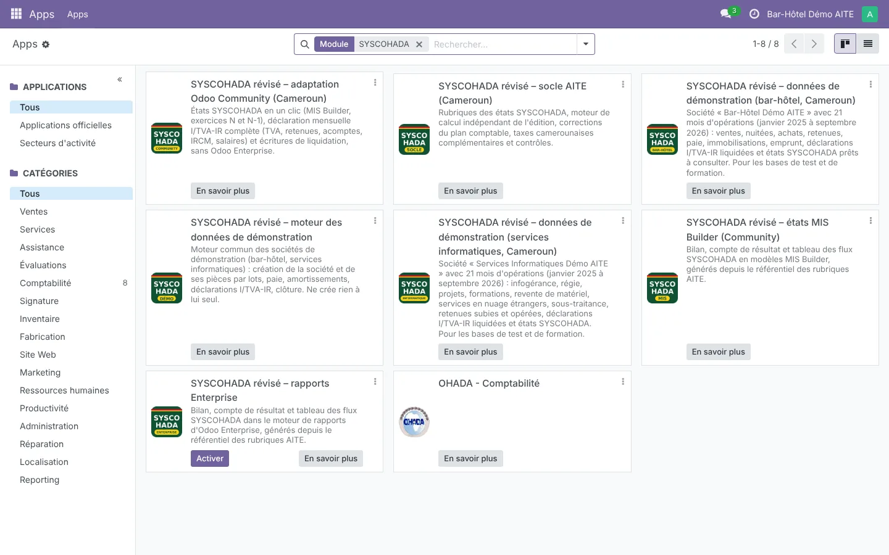

L'installation depuis le zip extrait a été vérifiée sur une base vierge en français (8 octobre 2026, version 18.0.1.3.0, seul le dossier `addons/` du paquet déclaré dans `addons_path`), comme le fait le bouton « Activer » : module principal et modules OCA en 37 secondes, passage d'une nouvelle société au plan « cm » par la Localisation fiscale (langues fr_BE, fr_CA et fr_CH présentes mais inactives), puis 107 tests sans échec ; sur une copie de cette base, les deux sociétés de démonstration s'installent en 114 secondes et passent leurs 34 tests.

### Données de démonstration

Deux modules facultatifs créent chacun, à leur installation, une société camerounaise complète (Douala, FCFA, plan « cm ») et ses pièces de janvier 2025 à septembre 2026 : « Bar-Hôtel Démo AITE » (`aite_syscohada_demo`, environ 700 pièces) et « Services Informatiques Démo AITE » (`aite_syscohada_demo_services`, environ 600 pièces). Ils reposent sur un moteur commun, `aite_syscohada_demo_common`, installé avec eux. Chacun s'installe seul ; les deux cohabitent dans la même base. Ils sont réservés aux bases de test et de formation.

```bash
odoo-bin -c odoo.conf -d <base de test> -i aite_syscohada_demo,aite_syscohada_demo_services \
  --load-language=fr_FR --stop-after-init
```

L'option `--load-language=fr_FR`, à la création de la base, charge le français avant les données de démonstration : les libellés des lignes L10 à L35, repris de la localisation `l10n_cm`, sont alors en français dans les déclarations générées. Le script `scripts/guide/prepare_db.sh` prépare ainsi la base des captures de ce guide.

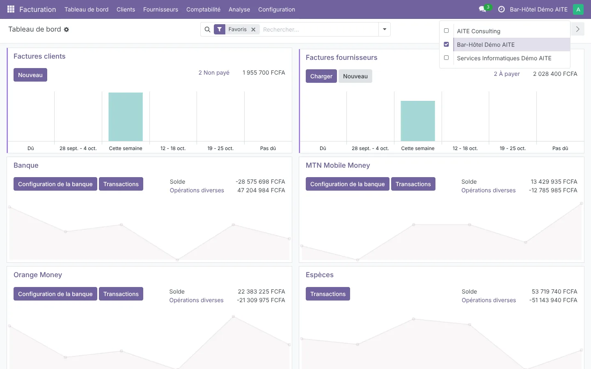

#### Bar-hôtel

| Opérations générées | Détail |
| --- | --- |
| Bar | Facture de synthèse mensuelle (bières, vins, boissons sans alcool), encaissée à 60 % en espèces, 25 % Orange Money, 15 % MTN Mobile Money ; versements en banque par le compte 585 |
| Hôtel | Nuitées et séminaires avec TVA sur encaissements (80 % encaissés dans le mois, le solde le 10) ; séminaire d'une société qui retient l'acompte de 2 % |
| Achats et charges | Brasseries avec précompte de 2 %, vins, électricité, téléphone, loyer avec précompte de 15 %, honoraires avec retenue de 5 %, logiciel étranger avec TVA autoliquidée et TSR, frais bancaires |
| Paie | Écriture globale mensuelle (CNPS, IRPP et CAC, CFC, FNE, RAV, TDL), salaires nets virés, cotisations payées le 15 |
| Investissement et financement | Capital de 30 000 000, aménagements et mobilier, chambre froide, dotations mensuelles, emprunt de 12 000 000 remboursé chaque mois |
| Clôture et résultat | Stock et ristourne au 31/12/2025, impôt illustratif, affectation du résultat au 30/06/2026, dividendes avec IRCM (ligne L57) |
| Déclarations | 21 déclarations I/TVA-IR : vingt calculées, liquidées, payées le 15 et validées ; septembre 2026 en brouillon |

Repères pour explorer, tous calculés à la main dans les tests du module :

| Repère | Montant (FCFA) |
| --- | --- |
| Résultat net 2025 (XI) | 1 253 472 |
| Résultat de janvier à septembre 2026 | 2 049 350 |
| Total du bilan au 30/09/2026 (BZ = DZ) | 44 941 362 |
| Trésorerie au 30/09/2026 (BT) | 22 922 286 |
| Déclaration de janvier 2025 : crédit de TVA reporté, total à payer | 2 164 162 ; 496 386 |
| Déclaration de septembre 2026 (brouillon) : TVA à payer, total à payer | 612 920 ; 1 068 786 |


#### Services informatiques

`aite_syscohada_demo_services` crée « Services Informatiques Démo AITE », Rue Njo-Njo à Bonapriso, Douala : une société de services qui vit de contrats et de prestations, avec retenues subies de ses clients et opérées sur ses fournisseurs.

| Opérations générées | Détail |
| --- | --- |
| Clients | Infogérance mensuelle d'une banque (3 000 000 HT par mois, 3 200 000 en 2026), TVA sur encaissement, acompte de 2 % retenu par la banque ; conseil en régie facturé au jour à un industriel (160 000, puis 176 000 par jour) ; projets au forfait de 4 000 000 pour un assureur, avec retenue de 5 % sur honoraires ; formations de 1 200 000 ; contrat de support annuel de 6 000 000 facturé d'avance le 01/10/2025 ; revente de matériel informatique aux PME |
| Achats et charges | Matériel acheté pour revente (75 % du prix de vente), loyer des bureaux avec précompte de 15 %, services en nuage d'un éditeur américain avec TVA autoliquidée et TSR, développeur indépendant non assujetti avec retenue de 5 %, internet, électricité, frais bancaires |
| Paie | Écriture globale mensuelle (brut de 3 000 000, puis 3 300 000), cotisations et impôts payés le 15 du mois suivant |
| Investissement et financement | Capital de 25 000 000 ; ordinateurs et serveur de développement (10 800 000), progiciel de gestion (7 200 000), serveurs de virtualisation (5 400 000, avril 2026), amortis sur 36 mois |
| Clôture et résultat | Stock de matériel au 31/12/2025 et au 30/09/2026, produits constatés d'avance de 4 500 000 (neuf mois de support restant à courir), impôt illustratif, affectation du résultat au 30/06/2026, dividendes de 4 750 000 avec IRCM (ligne L57 de juillet 2026) |
| Déclarations | 21 déclarations I/TVA-IR : vingt validées, septembre 2026 en brouillon ; crédit de TVA en janvier 2025 (investissements), crédit d'acompte en février 2025 (retenues subies supérieures à l'acompte du mois) |

| Repère | Montant (FCFA) |
| --- | --- |
| Résultat net 2025 (XI) | 9 504 750 |
| Impôt 2025 illustratif (27,5 % du résultat) : charge, acomptes et retenues imputés, solde payé le 15/03/2026 | 3 605 250 ; 2 194 720 ; 1 410 530 |
| Résultat de janvier à septembre 2026 | 11 617 350 |
| Total du bilan au 30/09/2026 (BZ = DZ) | 48 975 900 |
| Trésorerie au 30/09/2026 (BT) | 29 261 832 |
| Déclaration de février 2025 : crédit d'acompte reporté (L55), imputé en mars (L53) | 132 400 |
| Déclaration de septembre 2026 (brouillon) : TVA à payer, total à payer | 1 523 060 ; 2 357 068 |

Ces montants sont recalculés à la main dans `addons/aite_syscohada_demo_services/tests/test_demo_services.py` (19 tests) ; le scénario est décrit dans `models/scenario.py`.

La génération des deux sociétés dure environ deux minutes. Depuis l'interface, sur un serveur lancé avec des workers, relever temporairement `limit_time_cpu` et `limit_time_real` le temps de l'installation. La paie et l'impôt sur le résultat y sont illustratifs ; les taxes de retenue « taux à valider » ne sont activées que dans ces deux sociétés.

### Sur une instance Odoo 18 existante

1. Suivre « Depuis le paquet de livraison » ci-dessus : les dix modules de `addons/`, `requirements.txt`, redémarrage, mise à jour de la liste des Apps, installation de « SYSCOHADA révisé – adaptation Odoo Community (Cameroun) ». Ne pas installer les données de démonstration sur une base de recette ou de production : chacune crée une société et plusieurs centaines de pièces comptabilisées.
2. Si la société avait déjà le plan « cm » avant l'installation, le `post_init_hook` applique le paramétrage SYSCOHADA à toutes les sociétés concernées ; sinon il s'applique au chargement du plan.

### Enterprise

Mêmes étapes ; `aite_syscohada_reports` (`auto_install`) s'installe seul dès que `account_reports` est présent et ajoute les quatre états dans le moteur de rapports. Ses tests portent l'étiquette `aite_syscohada_enterprise` et ne tournent que sur une base Enterprise :

```bash
odoo-bin -d <base> -i aite_syscohada_reports --test-enable --test-tags aite_syscohada_enterprise --stop-after-init
```

### Mise à jour d'une version à l'autre

Une mise à jour du socle (`-u aite_syscohada_base`) rejoue le script `migrations/<version>/post-migrate.py`, qui relance le paramétrage : les comptes et taxes ajoutés par la nouvelle version apparaissent sans action manuelle. Les objets déjà utilisés par des écritures ne sont jamais modifiés (un avertissement est écrit dans le journal).

Passage à la version 18.0.1.2.0 : copier aussi les nouveaux modules (`aite_syscohada_demo_common`, `aite_syscohada_demo_services`), puis `-u aite_syscohada_base`. Cette version corrige l'ouverture des quatre états MIS depuis le menu Analyse, affiche toutes les lignes de l'onglet « Retenues, acomptes, IRCM, salaires » et met en français les libellés restés en anglais ; elle ne change pas le paramétrage. Les données de démonstration déjà générées ne sont pas recalculées : créer une nouvelle base de test pour la dernière version des scénarios.

## 3. Paramétrage initial

### Création de la société camerounaise

Une société dont le pays est le Cameroun reçoit la devise XAF et le plan comptable « cm » sans réglage supplémentaire. Le paramétrage AITE s'enchaîne aussitôt si le module `aite_syscohada_base` est déjà installé.

1. Installer les modules sur la base : `../venv/bin/python ../odoo18/odoo-bin -c odoo.conf -d <base> -i aite_syscohada_community --stop-after-init`. Les modules `aite_syscohada_mis` et `aite_syscohada_base` suivent par dépendance, ainsi que `l10n_cm`.
2. Ouvrir Paramètres > Utilisateurs & Sociétés > Sociétés et créer la société.
3. Renseigner le champ Pays avec Cameroun. Le champ Devise passe de lui-même à XAF.
4. Enregistrer. Odoo active la devise XAF, puis charge le plan « cm » en fin de transaction.
5. Vérifier dans Facturation > Configuration > Paramètres, section Localisation fiscale, que le champ Pack affiche « SYSCOHADA pour Sociétés ». Si le champ est vide, le choisir et enregistrer : l'enregistrement charge le plan.

Le plan « cm » hérite du plan `syscohada` avec des codes à six chiffres : 4111 devient 411100, 6011 devient 601100. Le chargement fixe aussi le pays d'imposition Cameroun. La taxe de vente par défaut est « 19.25% », la taxe d'achat par défaut « 19.25% G ». Le compte client est 411100 et le compte fournisseur 401100. Les préfixes sont 521 pour les banques, 571 pour les caisses et 585 pour les virements internes.

Le module `aite_syscohada_base` surcharge `account.chart.template._load()`. Dès que le plan est chargé sur une société SYSCOHADA, `_aite_syscohada_setup()` s'exécute. Le `post_init_hook` traite les sociétés existant avant l'installation du module : il applique le paramétrage à toutes les sociétés dont le plan est `cm`, `syscohada` ou un plan dérivé de `syscohada`.

### Ce que fait le paramétrage

Le paramétrage `res.company._aite_syscohada_setup()` se déroule en cinq étapes, toujours dans le même ordre, puis horodate le champ « Paramétrage SYSCOHADA AITE appliqué le ». Il ne fait rien pour une société dont le plan n'est pas SYSCOHADA. Le code est dans `addons/aite_syscohada_base/models/res_company.py`.

Les comptes sont lus par `_aite_account(code)` : le code est complété à six chiffres par des zéros, puis cherché tel quel. `_aite_account("4432")` renvoie 443200. Les comptes d'un préfixe sont lus par `_aite_accounts_prefix("445")`.

1. **Libellés corrigés.** Les 45 libellés de la table `ACCOUNT_LABELS` sont réécrits en anglais et dans chaque langue installée dont le code commence par « fr ». Le compte 129 n'existe pas dans le plan « cm » : son libellé est ignoré. Si le français est installé après le paramétrage, relancez celui-ci. Le tableau complet figure en annexe.
2. **Types de comptes.** Les comptes de TVA récupérable 4451 à 4456 et les créances sur l'État 4492 à 4496 passent en « Actifs circulants ». Les comptes 4811 et 4812 deviennent des comptes « Fournisseur » lettrables. Tout compte 16 ou 17 de type « Dettes à court terme » devient « Passif immobilisé », sauf les intérêts courus 166 et 176.
3. **Sous-comptes.** Les 32 comptes de la table `SUB_ACCOUNTS` sont créés s'ils manquent. Dix viennent du lot 0 : sept comptes d'amortissements et de dépréciations, le compte d'attente 443800, puis 552100 et 552200. Les 22 autres viennent du lot 2 : 441100, seize comptes 447110 à 447260 et cinq comptes 449210 à 449250.
4. **Écarts de caisse.** La perte va à 658800 « Autres charges diverses », le gain à 758800 « Autres produits divers ». Les champs de société « Différence de caisse charges » et « Différence de caisse revenus » reçoivent ces comptes. Sur chaque journal de banque et d'espèces, un « Compte des pertes » renseigné est remplacé s'il ne commence pas par 6, un « Compte de profit » s'il ne commence pas par 7. Les comptes techniques d'Odoo 999001 et 999002 passent en « Obsolète » s'ils ne portent aucune écriture comptabilisée.
5. **Taxes**, seulement si le plan est exactement « cm ». La case « Comptabilité de trésorerie » est cochée. Un groupe de taxes « Retenues, précomptes et autres taxes » est créé, séquence 90. Treize taxes sont créées, chacune seulement si ses comptes existent : elles sont détaillées en annexe. Enfin, la taxe « 19.25% S » de `l10n_cm` passe du compte 445200 au compte 445400. Si des écritures comptabilisées l'utilisent déjà, le compte ne change pas et Odoo journalise « AITE SYSCOHADA : taxe 19.25% S déjà utilisée, compte 4452 conservé ».

Chaque taxe créée est enregistrée sous l'identifiant externe `aite_syscohada_base.<id société>_<clé>`, en `noupdate`. `_aite_tax_ref(clé)` la retrouve ; une taxe déjà enregistrée n'est jamais recréée.


La taxe « 19,25 % S (encaissement) » a l'exigibilité « Basé sur le paiement ». À la facture, la TVA va en 443800. Au paiement, le journal « TVA sur encaissements » la transfère en 443200, au prorata du montant encaissé. Les douze autres taxes sont exigibles à la facture. Onze taxes sont créées inactives : leur taux est écrit dans le code mais n'est pas validé. Ne les activez qu'après confirmation du taux par l'expert-comptable.


### Relancer le paramétrage

Le menu Facturation > Configuration > SYSCOHADA > Appliquer le paramétrage relance le paramétrage sur la société courante.

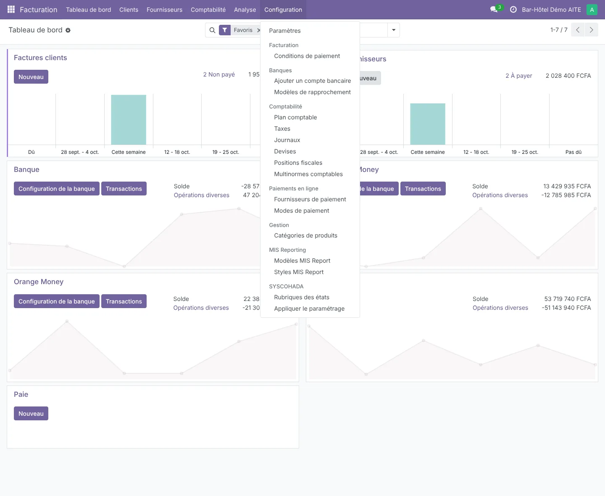

1. Sélectionner la société à paramétrer dans le sélecteur de sociétés : l'action ne traite que cette société.
2. Cliquer sur Appliquer le paramétrage.
3. Lire la notification « SYSCOHADA », message « Paramétrage appliqué. ». Pour une société qui n'est pas à un plan SYSCOHADA, le menu affiche à la place un message d'erreur qui donne son plan actuel et la marche à suivre, et ne modifie rien (versions antérieures à 18.0.1.3.1 : notification de succès trompeuse).

Le menu SYSCOHADA n'est visible que par le groupe `account.group_account_manager`. Il contient aussi « Rubriques des états », la liste des 124 rubriques du référentiel. Relancez le paramétrage après l'installation du français, ou après la création manuelle d'un compte attendu par le paramétrage. Le bouton « Recharger » des paramètres de comptabilité relance aussi le paramétrage ; Odoo ne l'affiche que si la société a déjà des écritures.

### Journaux

Le chargement du plan crée sept journaux. Seuls les journaux de trésorerie réels restent à créer ou à adapter, dans Facturation > Configuration > Comptabilité > Journaux.

| Journal créé par Odoo | Nom affiché en français | Type | Compte par défaut |
| --- | --- | --- | --- |
| Customer Invoices (INV) | Factures clients | Ventes | 701100 |
| Vendor Bills (BILL) | Factures fournisseurs | Achats | 601100 |
| Miscellaneous Operations (MISC) | Opérations diverses | Divers | aucun |
| Exchange Difference (EXCH) | Différence de change | Divers | aucun |
| Cash Basis Taxes (CABA) | TVA sur encaissements | Divers | aucun |
| Bank (BNK1) | Banque | Banque | compte 521 créé par Odoo |
| Cash (CSH1) | Espèces | Espèces | compte 571 créé par Odoo |

1. **Banque** : un journal de type Banque par compte bancaire. Renseigner le « Numéro de compte » et vérifier que le champ « Compte bancaire » pointe sur un compte 521.
2. **Caisse** : un journal de type Espèces par caisse physique, champ « Compte d'espèces » sur un compte 571. Le contrôle « Aucune caisse créditrice » signale en erreur tout compte 57 à solde créditeur.
3. **Monnaie électronique** : un journal par opérateur, champ « Compte bancaire » sur le compte dédié.

| Opérateur | Compte créé par le paramétrage | Libellé du compte | Type de journal conseillé |
| --- | --- | --- | --- |
| Orange Money | 552100 | Monnaie électronique, Orange Money | Banque |
| MTN Mobile Money | 552200 | Monnaie électronique, MTN Mobile Money | Banque |

Le type Banque est conseillé pour la monnaie électronique : le contrôle « Paiements fournisseurs en espèces > 100 000 FCFA » ne compte que les journaux de type Espèces. Pour un troisième opérateur, créer d'abord un compte 5523xx de type « Banque et espèces » dans le plan comptable. Les rubriques BS (55 débiteur) et DR (55 créditeur) le captent sans autre réglage ; un code à sept chiffres comme 5521001 est aussi capté, ce que vérifie un test avancé.

Les journaux de banque et d'espèces créés ensuite reçoivent 758800 en « Compte de profit » et 658800 en « Compte des pertes ». Le contrôle « Comptes d'attente et de virements internes soldés » attend un solde nul sur 471, 585 et 588, sur le compte d'attente bancaire de la société et sur son compte de virements internes.

### Droits des utilisateurs

Les menus Syscohada demandent le groupe technique `account.group_account_readonly`. Le profil « Administrateur » de la comptabilité ne le donne pas en Community : il faut l'ajouter en mode développeur.

| Menu | Chemin | Groupe requis |
| --- | --- | --- |
| États et contrôles (AITE) | Facturation > Analyse > Syscohada | `account.group_account_readonly` |
| Bilan actif, Bilan passif, Compte de résultat, Tableau des flux de trésorerie | Facturation > Analyse > Syscohada | `account.group_account_readonly` |
| Déclarations de TVA (Cameroun) | Facturation > Analyse > Syscohada | `account.group_account_readonly` |
| SYSCOHADA, Rubriques des états, Appliquer le paramétrage | Facturation > Configuration > SYSCOHADA | `account.group_account_manager` |

1. Activer le mode développeur.
2. Ouvrir Paramètres > Utilisateurs & Sociétés > Utilisateurs, puis l'utilisateur.
3. Onglet Droits d'accès, champ Comptabilité : « Administrateur » pour un comptable qui crée et valide les déclarations, « Facturation » pour un utilisateur qui consulte seulement les états et les déclarations.
4. Section Technique : cocher « Montrer les fonctions de comptabilité complètes ». Le menu Syscohada, les pièces comptables et le plan comptable deviennent visibles.

| Modèle | `account.group_account_readonly` | `account.group_account_manager` |
| --- | --- | --- |
| Rubriques des états (`aite.syscohada.rubrique`) | lecture | tous droits |
| Assistant États et contrôles, lignes d'états et de contrôles | tous droits | aucun droit propre |
| Déclaration de TVA (`aite.cm.vat.declaration`) et ses lignes | lecture | tous droits |
| Lignes du formulaire I/TVA-IR (`aite.cm.itvair.line`) | lecture | tous droits |

Un utilisateur qui n'a que le groupe lecture seule peut lancer les états et ouvrir les déclarations. Il ne peut ni les créer, ni les recalculer, ni les valider.

### Idempotence et mise à jour

Relancer le paramétrage ne crée jamais de doublon ; le test `test_setup_is_idempotent` le vérifie.

- **Libellés et types** : réimposés à chaque passage. Un compte de la table `ACCOUNT_LABELS` renommé à la main retrouve le libellé du code.
- **Sous-comptes** : créés seulement s'ils manquent. Un sous-compte renommé garde son nouveau libellé.
- **Taxes** : créées seulement si l'identifiant externe est absent. Le champ Actif n'est jamais touché : une retenue activée par le comptable reste active.
- **Objets déjà utilisés** : comptes 999001 et 999002, compte de la taxe `precompte_achats` et compte de la taxe « 19.25% S » ne changent que s'ils n'ont aucune écriture comptabilisée.
- **Erreurs** : chaque changement de type, de journal ou de compte de taxe passe par un point de sauvegarde. En cas d'erreur, Odoo journalise « AITE SYSCOHADA : \<modèle> \<objet> non modifié (\<erreur>) » et le paramétrage continue.

Pour mettre à jour une base existante :

1. Remplacer les modules dans `addons/`.
2. Lancer `../venv/bin/python ../odoo18/odoo-bin -c odoo.conf -d <base> -u aite_syscohada_base --stop-after-init`. La mise à jour du socle entraîne celle des modules qui en dépendent, et le script `migrations/<version>/post-migrate.py` relance le paramétrage.
3. Lire le journal d'Odoo : les lignes « AITE SYSCOHADA » signalent les objets non modifiés.

## 4. Saisie quotidienne

La taxe posée sur chaque ligne de facture décide du compte de TVA, de la ligne de la déclaration et du moment d'exigibilité. Le comptable ne saisit donc jamais la TVA à la main : il choisit la bonne taxe, le bon compte de charge ou de produit et le bon journal. Les états et la déclaration se déduisent de ces trois choix.

### Repères communs à tous les flux

Les taxes « 19.25% », « 19.25% G », « 19.25% S », « 0% EX » et « 0% » viennent du plan « cm » d'Odoo ; les autres sont créées par le paramétrage AITE. Les sept premières du tableau sont actives. Les autres sont créées inactives : leur taux ou leur barème reste à valider.

| Flux | Taxe dans Odoo | Compte de TVA | Ligne I/TVA-IR | État à l'installation |
| --- | --- | --- | --- | --- |
| Vente de marchandises | « 19.25% » | 443100 | L10 | Active, taxe de vente par défaut |
| Prestation de services vendue | « 19,25 % S (encaissement) » | 443800, puis 443200 au paiement | L10, au paiement seulement | Active |
| Exportation | « 0% EX » (vente) | aucun | L13 | Active |
| Vente exonérée | « 0% » (vente) | aucun | L14 | Active |
| Achat de marchandises | « 19.25% G » | 445200 | L18 | Active, taxe d'achat par défaut |
| Service acheté | « 19.25% S » | 445400 | L19 | Active |
| Immobilisation | « 19,25 % I » | 445100 | L18 | Active |
| Service d'un prestataire étranger | « TVA 19,25 % autoliquidée, services étrangers (à valider) » | 445400 et 447161 | L21 et L38 | Inactive |
| Précompte sur achats | « Précompte sur achats (taux à valider) » | 449210 | L46 | Inactive |
| Retenues opérées et subies | huit taxes suffixées « (taux à valider) » | 447120 à 447170, 449220 à 449240 | L0, L37, L40, L42, L43, L45, L47, L48 | Inactives |
| Taxe de séjour | « Taxe de séjour (à paramétrer) » | 442200 | aucune | Inactive |

Le chargement du plan crée les journaux « Factures clients », « Factures fournisseurs », « Banque », « Espèces », « Opérations diverses » et « TVA sur encaissements ». Le module Point de Vente ajoute le journal « Point de Vente ». Les codes du plan ont six chiffres : 4431 s'écrit 443100. Le compte du journal « Banque » est 521001, celui du journal « Espèces » 571001. Les exemples viennent de `docs/flux-comptables-syscohada.html` et des tests du dépôt.

En Community, le bouton « Payer » ne mouvemente pas directement 521001 : il passe par un compte 521 de paiements en suspens, soldé au rapprochement du relevé. Les exemples montrent l'écriture une fois le relevé rapproché.

### Ventes de marchandises

Une vente se facture avec la taxe « 19.25% » dans le journal « Factures clients », sur le compte 701100. La TVA va en 443100 dès la validation.

Exemple : 1 000 000 hors taxes, payés par virement trente jours plus tard.

| Compte | Débit | Crédit |
| --- | --- | --- |
| 411100 Clients | 1 192 500 |  |
| 701100 Vente de marchandises dans la région |  | 1 000 000 |
| 443100 État, TVA facturée sur ventes |  | 192 500 |

Au paiement, bouton « Payer », journal « Banque » : débit 521001, crédit 411100 pour 1 192 500. Dans les états : TA puis XB ; BI si la facture reste impayée au 31 décembre ; DK pour la TVA non reversée. Dans la déclaration : L10 base 1 000 000 et taxe 192 500, puis L15, base de l'acompte L50. Un avoir avec la même taxe vient en négatif sur L10.

### Prestations de services

Une prestation se facture avec la taxe « 19,25 % S (encaissement) » et le compte 706100. Son exigibilité est « Basé sur le paiement » et son compte d'attente 443800 : la TVA n'entre dans la déclaration qu'une fois encaissée.

1. Sur la ligne de facture, renseigner 706100 dans la colonne « Compte », ou dans le « Compte des revenus » de l'article.
2. Choisir la taxe « 19,25 % S (encaissement) ». La facture crédite 443800, pas 443200.
3. Encaisser avec le bouton « Payer ». Le lettrage crée une écriture dans le journal « TVA sur encaissements » : débit 443800, crédit 443200.

Exemple : 100 000 hors taxes.

| Compte | Débit | Crédit |
| --- | --- | --- |
| 411100 Clients | 119 250 |  |
| 706100 Services vendus dans la région |  | 100 000 |
| 443800 État, TVA facturée sur prestations non encore exigible |  | 19 250 |

Au paiement, journal « TVA sur encaissements » : débit 443800, crédit 443200 pour 19 250. Un paiement partiel transfère la TVA au prorata : 59 625 encaissés sur 119 250 déplacent 9 625 en 443200 et en laissent 9 625 en 443800.

Dans les états : TC puis XB ; DK pour 443200 et 443800. Dans la déclaration, la base et la taxe entrent en L10 au mois du paiement seulement. La liquidation ne touche jamais 443800.

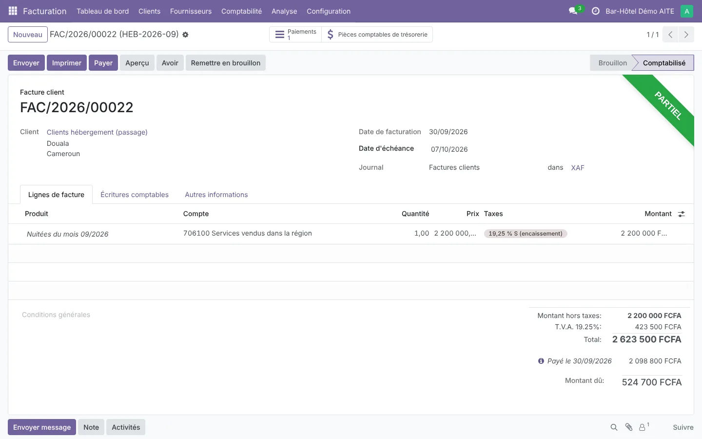

### Acomptes clients

Un acompte reçu avant la facture se crédite en 419100 « Clients, avances et acomptes reçus », pas en produit, dans le journal de trésorerie qui reçoit l'argent.

| Compte | Débit | Crédit |
| --- | --- | --- |
| 552100 Monnaie électronique, Orange Money | 50 000 |  |
| 419100 Clients, avances et acomptes reçus |  | 50 000 |

À la facture du séjour, l'acompte s'impute : débit 419100, crédit 411100. Un solde créditeur de 419100 va en DI au passif. Le module ne calcule pas la TVA d'un acompte : son traitement est à valider avec l'expert-comptable.

### Achats de marchandises

Une facture de boissons se saisit dans « Factures fournisseurs » avec la taxe « 19.25% G » sur le compte 601100. La TVA va en 445200 et alimente L18.

| Compte | Débit | Crédit |
| --- | --- | --- |
| 601100 Achats de biens dans la région | 800 000 |  |
| 445200 État, TVA récupérable sur achats | 154 000 |  |
| 401100 Fournisseurs |  | 954 000 |

Dans les états : RA, puis XA avec la variation de stock ; DJ pour la dette ; 445200 en BJ tant que la TVA n'est pas liquidée. Un paiement fournisseur de plus de 100 000 FCFA dans un journal de type Espèces est relevé par le contrôle « Paiements fournisseurs en espèces > 100 000 FCFA ».

### Services achetés

Un service acheté prend la taxe « 19.25% S », dont le paramétrage a basculé le compte de 445200 vers 445400. Elle alimente L19, distincte de L18. La bascule n'a lieu que si la taxe n'a servi à aucune écriture comptabilisée.

| Compte | Débit | Crédit |
| --- | --- | --- |
| 631800 Autres frais bancaires | 10 000 |  |
| 445400 État, TVA récupérable sur services extérieurs et autres charges | 1 925 |  |
| 401100 Fournisseurs |  | 11 925 |

Le même schéma vaut pour des honoraires en 632400.

### Immobilisations

Une immobilisation se facture avec la taxe « 19,25 % I » et un compte de classe 2. Le fournisseur d'investissement a 481200 comme « Compte fournisseur », rendu lettrable par le paramétrage.

1. Sur la fiche du fournisseur, onglet « Facturation », mettre 481200 dans « Compte fournisseur ».
2. Sur la ligne de facture, choisir le compte d'immobilisation, par exemple 241100, et la taxe « 19,25 % I ».

| Compte | Débit | Crédit |
| --- | --- | --- |
| 241100 Matériel industriel | 2 400 000 |  |
| 445100 État, TVA récupérable sur immobilisations | 462 000 |  |
| 481200 Fournisseurs d'investissements, immobilisations corporelles |  | 2 862 000 |

Dans les états : AM brut 2 400 000 ; DH tant que la dette court ; L18 pour 462 000. Au tableau des flux, FG reprend l'acquisition corrigée de la variation de la dette 481.

### Fournisseur étranger

Une prestation d'un prestataire étranger relève de la taxe « TVA 19,25 % autoliquidée, services étrangers (à valider) », inactive à l'installation. Elle porte deux lignes de taxe : 445400 à +100 % avec l'étiquette de L21, et 447161 à −100 %. La dette fournisseur ne comprend pas de TVA.

| Compte | Débit | Crédit |
| --- | --- | --- |
| 632400 Frais pour les professions réglementées | 1 000 000 |  |
| 445400 État, TVA récupérable sur services extérieurs et autres charges | 192 500 |  |
| 447161 État, TVA autoliquidée sur prestations étrangères |  | 192 500 |
| 401100 Fournisseurs |  | 1 000 000 |

Dans la déclaration : L21 pour 192 500 en déductible et L38 pour 192 500 à reverser. Si la TSR est due, elle passe par la taxe « TSR sur rémunérations versées à l'étranger (taux à valider) », compte 447120, ligne L0.

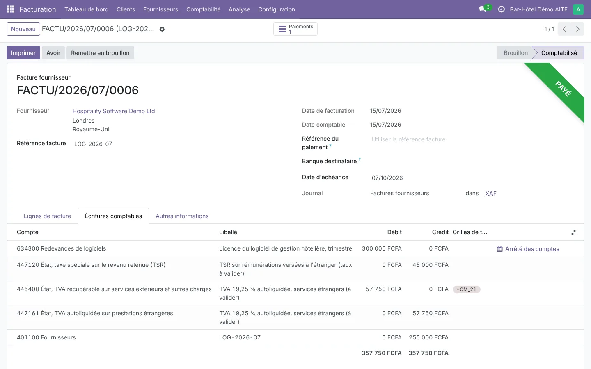

### Retenues à la source subies et opérées

Les retenues sont des taxes à taux négatif, rangées dans le groupe « Retenues, précomptes et autres taxes » et inactives jusqu'à validation des taux. Une retenue opérée réduit la dette fournisseur ; une retenue subie réduit la créance client. La ligne de la déclaration lit les mouvements du compte de la retenue. Pour les activer : Facturation > Configuration > Comptabilité > Taxes, filtre « Inactif ».

| Taxe dans Odoo | Sens | Taux dans le code | Compte | Ligne |
| --- | --- | --- | --- | --- |
| « Précompte sur loyers retenu (taux à valider) » | achat | −15 % | 447130 | L42 |
| « Retenue sur honoraires (taux à valider) » | achat | −5 % | 447140 | L43 |
| « TSR sur rémunérations versées à l'étranger (taux à valider) » | achat | −15 % | 447120 | L0 |
| « TVA retenue à la source, entreprise habilitée (taux à valider) » | achat | −19,25 % | 447160 | L37 |
| « Acompte sur CA retenu à la source (taux à valider) » | achat | −2 % | 447170 | L40 |
| « Acompte sur CA retenu par le client (taux à valider) » | vente | −2 % | 449220 | L45 |
| « Précompte sur loyers retenu par le locataire (taux à valider) » | vente | −15 % | 449230 | L47 |
| « Retenue sur honoraires subie (taux à valider) » | vente | −5 % | 449240 | L48 |

Retenue opérée, loyer de 500 000 :

| Compte | Débit | Crédit |
| --- | --- | --- |
| 622200 Location d'immeubles | 500 000 |  |
| 447130 État, précomptes retenus sur loyers |  | 75 000 |
| 401100 Fournisseurs |  | 425 000 |

Retenue subie, vente de 1 000 000 avec « 19.25% » et « Acompte sur CA retenu par le client (taux à valider) » :

| Compte | Débit | Crédit |
| --- | --- | --- |
| 411100 Clients | 1 172 500 |  |
| 449220 État, acomptes sur chiffre d'affaires retenus par les clients | 20 000 |  |
| 701100 Vente de marchandises dans la région |  | 1 000 000 |
| 443100 État, TVA facturée sur ventes |  | 192 500 |

Dans la déclaration : L42 base 500 000 et 75 000 à reverser ; L45 base 1 000 000 et 20 000 à déduire, repris en L52. La liquidation de TVA ne touche pas ces comptes. Attention : une facture fournisseur avec retenue extournée dans le mois reste comptée dans la ligne de retenue (défaut connu, voir la section Dépannage).

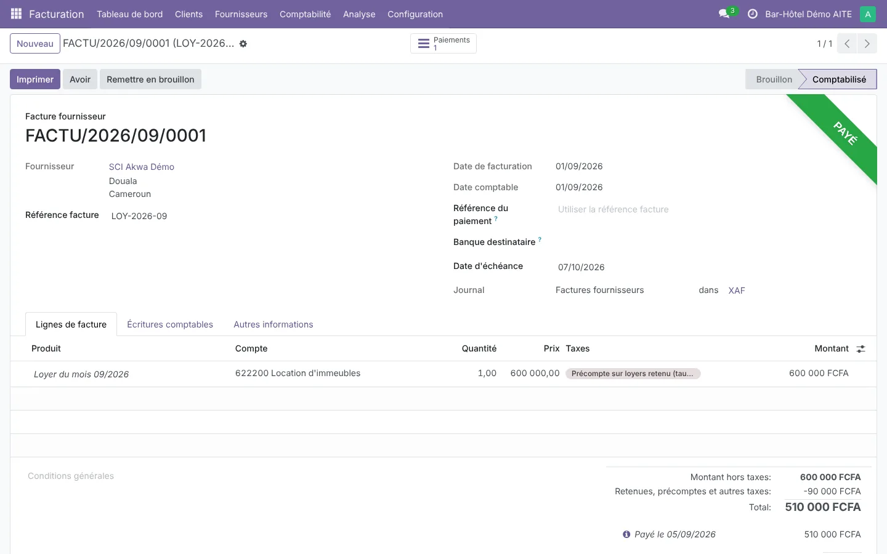

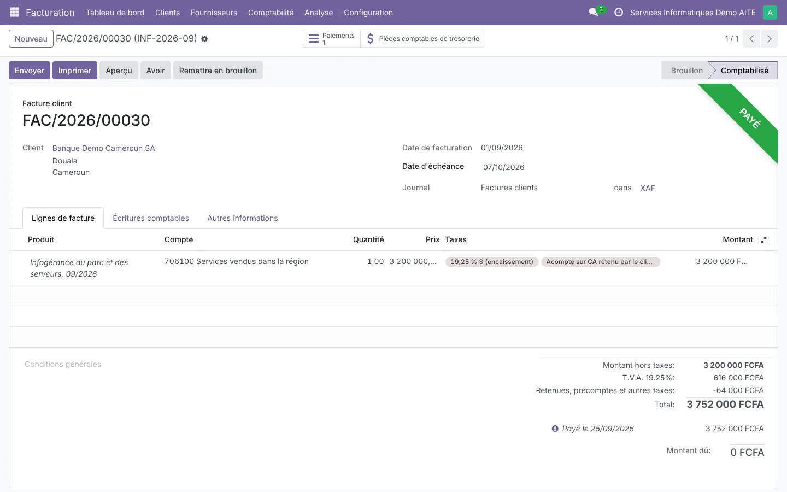

### Précompte sur achats

Le précompte facturé par un fournisseur n'est pas une charge : c'est une avance d'impôt en 449210. La taxe « Précompte sur achats (taux à valider) » vaut 2 % dans le code, reste inactive et s'ajoute à « 19.25% G » sur la ligne d'achat.

| Compte | Débit | Crédit |
| --- | --- | --- |
| 601100 Achats de biens dans la région | 1 000 000 |  |
| 445200 État, TVA récupérable sur achats | 192 500 |  |
| 449210 État, précomptes sur achats subis | 20 000 |  |
| 401100 Fournisseurs |  | 1 212 500 |

Dans la déclaration : L46 base 1 000 000 et 20 000, repris en L49 puis L52. Le compte 447180 alimente L41 mais aucune taxe ne l'utilise : il se mouvemente par écriture manuelle.

### Taxe de séjour

La taxe de séjour est une taxe à montant fixe, créée inactive avec un montant de 0 et le compte 442200. Elle n'alimente aucune ligne de la déclaration. Son compte, sa base et son exigibilité sont des questions ouvertes de `ROADMAP.md`. Exemple illustratif, deux nuits à 50 000 hors taxes et 2 000 de taxe :

| Compte | Débit | Crédit |
| --- | --- | --- |
| 411100 Clients | 121 250 |  |
| 706100 Services vendus dans la région |  | 100 000 |
| 443800 État, TVA facturée sur prestations non encore exigible |  | 19 250 |
| 442200 État, impôts et taxes pour les collectivités publiques |  | 2 000 |

### Point de vente et caisse

Le point de vente passe une écriture de synthèse à la fermeture de la session, dans le journal « Point de Vente ». Chaque mode de paiement est rattaché à un journal : « Espèces » pour la caisse, un journal de type Banque par opérateur de monnaie électronique. Le plan « cm » n'a pas de compte 515 : il faut créer 515000 pour les cartes.

Exemple : 596 250 TTC, encaissés 350 000 en espèces, 146 250 en mobile money, 100 000 par carte.

| Compte | Débit | Crédit |
| --- | --- | --- |
| 571001 Espèces | 350 000 |  |
| 552100 Monnaie électronique, Orange Money | 146 250 |  |
| 515000 Cartes de crédit à encaisser, à créer | 100 000 |  |
| 701100 Vente de marchandises dans la région |  | 500 000 |
| 443100 État, TVA facturée sur ventes |  | 96 250 |

Ce tableau est une vue nette : Odoo crédite les ventes et la TVA contre 411300 « Clients, point de vente », puis solde ce compte par mode de paiement.

- **Écart de caisse** : un manquant de 5 000 donne débit 658800, crédit 571001.
- **Dépôt en banque** : il transite par 585001, compte de virements internes créé par Odoo. Débit 585001, crédit 571001 au départ ; débit 521001, crédit 585001 à réception.
- **Note de chambre** : le mode de paiement « Compte client » avec « Identifier le client » débite le compte client du client, 411100 par défaut. La note de séjour récapitule cette consommation sans la refacturer.
- **Contrôles** : « Comptes d'attente et de virements internes soldés » signale tout solde sur 471, 585 ou 588 ; « Aucune caisse créditrice » signale en erreur un compte 57 créditeur.

### Stocks

Le référentiel lit le stock de marchandises dans BB (comptes 31 à 38, nets de 39) et sa variation dans RB (6031). En inventaire intermittent, les achats restent en 601100 toute l'année et deux écritures corrigent le coût des ventes.

| Écriture | Débit | Crédit |
| --- | --- | --- |
| 1er janvier, reprise du stock initial | 603100 : 2 000 000 | 311100 : 2 000 000 |
| 31 décembre, stock compté | 311100 : 3 000 000 | 603100 : 3 000 000 |

Avec la valorisation automatisée d'Odoo Inventaire, les catégories d'articles doivent pointer sur des comptes 31 et 6031, sinon BB et RB ne voient pas les mouvements.

### Paie en écriture manuelle

Tant que le lot 5 n'est pas livré, la paie se passe en écriture manuelle. Chaque impôt sur salaire a son compte, et chaque compte sa ligne : 447210 et 447215 alimentent L67, 447220 L68, 447230 L69, 447240 L70, 447250 L71, 447260 L72. Le compte générique 447200 n'alimente aucune ligne.

| Compte | Débit | Crédit |
| --- | --- | --- |
| 661100 Salaires et commissions | 1 000 000 |  |
| 447210 État, IRPP retenu sur salaires |  | 100 000 |
| 447215 État, centimes additionnels communaux sur IRPP |  | 10 000 |
| 447220 État, Crédit foncier du Cameroun, part salariale |  | 10 000 |
| 447250 État, redevance audiovisuelle |  | 2 000 |
| 447260 État, taxe de développement local |  | 1 000 |
| 422000 Personnel, rémunérations dues |  | 877 000 |

Charges de l'employeur : débit 641300 pour 25 000, crédit 447230 pour 15 000 et 447240 pour 10 000. Les montants sont illustratifs. La part salariale CNPS se crédite en 431 ; la part patronale passe par 664100 et 431. Déclaration : L67 110 000 avec les CAC, L68 10 000, L69 15 000, L70 10 000, L71 2 000, L72 1 000, L73 148 000.


### Immobilisations et amortissements

La dotation annuelle débite 681300 et crédite le compte 28 de l'immobilisation, dans « Opérations diverses ». En Community, le module OCA `account_asset_management` peut générer ces écritures. Exemple : chambre froide amortie en cinq ans, débit 681300 et crédit 284100 pour 480 000. Dans les états : RL, colonne amortissements de AM, et réintégration dans la CAFG (FA).

### Emprunts

Un emprunt se crédite en 162000 à la réception des fonds. À chaque échéance, seul l'intérêt est une charge, en 671200 ; le capital remboursé débite 162000.

| Écriture | Débit | Crédit |
| --- | --- | --- |
| Réception des fonds | 521001 : 4 000 000 | 162000 : 4 000 000 |
| Échéance | 162000 : 800 000 ; 671200 : 120 000 | 521001 : 920 000 |

À la clôture, les intérêts courus se constatent par débit 671200, crédit 166200. Au tableau des flux : FO 4 000 000 et FQ −800 000 ; 166 est exclu des deux.

### Affectation du résultat

Tant que l'affectation n'est pas passée, le résultat de N-1 reste dans CJ et le contrôle « Résultats antérieurs à affecter » le signale, sans bloquer. L'affectation se passe après l'assemblée générale.

| Compte | Débit | Crédit |
| --- | --- | --- |
| 131000 Résultat net : bénéfice | 2 200 000 |  |
| 111000 Réserve légale |  | 220 000 |
| 465000 Associés, dividendes à payer |  | 1 000 000 |
| 121000 Report à nouveau créditeur |  | 980 000 |

Avant cette écriture, le résultat de N-1 est porté en 131000 par débit 999999 « Profits/pertes non distribués » ; ce transfert est neutre pour CJ.

### Dividendes

Le paiement des dividendes débite 465000 et crédite la banque ; le tableau des flux le montre en FN. La retenue sur les dividendes se déclare à la ligne L57 « Revenus des actions, parts sociales et assimilés », colonne « Base saisie ». Le code propose 15 % dans « Taux ou tarif » et 10 % de CAC, tous deux modifiables. Le compte 447110 « État, IRCM retenu à la source » existe, mais aucune taxe ni aucune ligne ne le lit.

### Ce qu'il ne faut pas faire

- **« 19.25% G » sur un service** : le montant passe en L18 au lieu de L19.
- **« 19,25 % S (encaissement) » sur une vente de marchandises** : la TVA reste en 443800 et n'entre en L10 qu'au paiement.
- **« 19.25% » sur une prestation** : la TVA entre en L10 dès la facture, sans attendre l'encaissement.
- **TVA saisie à la main sur 443 ou 445 sans taxe** : la déclaration ne la voit pas et la liquidation ne la solde pas.
- **Fournisseur payé plus de 100 000 FCFA par un journal Espèces** : le contrôle signale une TVA non déductible.
- **Solde laissé sur 471, 585 ou 588** : il cache un dépôt en route ou une opération non identifiée.
- **Immobilisation facturée sur un fournisseur en 401100** : la dette sort en DJ au lieu de DH, et le flux FG est faux.
- **Paie passée sur 447200** : les lignes L67 à L73 restent à zéro.
- **Affectation du résultat N-1 oubliée** : il reste dans CJ et le contrôle le signale.

## 5. États financiers

### Où trouver les états

Les états SYSCOHADA s'ouvrent depuis le menu Facturation > Analyse > Syscohada (Comptabilité > Analyse > Syscohada sur Enterprise). Le menu « Syscohada » vient du module `l10n_syscohada` d'Odoo et est réservé au groupe `account.group_account_readonly`.

| Menu | Module | Ce qui s'ouvre |
| --- | --- | --- |
| États et contrôles (AITE) | aite\_syscohada\_base | Assistant « États SYSCOHADA et contrôles » |
| Bilan actif, Bilan passif, Compte de résultat, Tableau des flux de trésorerie | aite\_syscohada\_community | Instance MIS « SYSCOHADA – … » |
| Déclarations de TVA (Cameroun) | aite\_syscohada\_community | Déclaration mensuelle I/TVA-IR |
| SYSCOHADA – Bilan actif … Tableau des flux de trésorerie | aite\_syscohada\_reports | Rapports `account.report`, Enterprise seulement |

Le référentiel des rubriques se consulte dans Facturation > Configuration > SYSCOHADA > Rubriques des états, réservé au groupe `account.group_account_manager`.

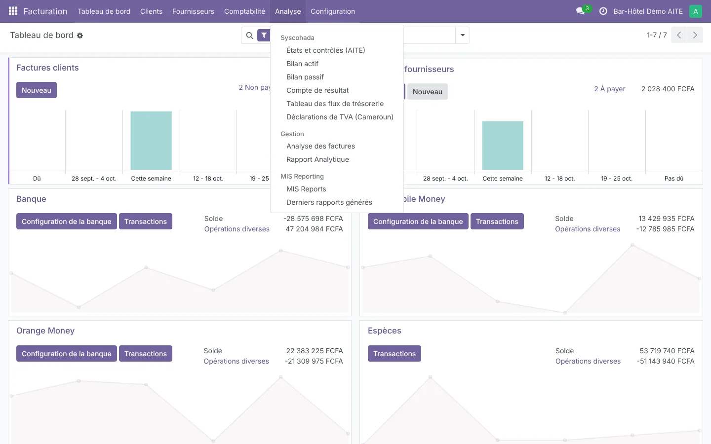

### L'assistant « États SYSCOHADA et contrôles »

L'assistant calcule les quatre états et les contrôles en une seule action, pour une société et une période. Il appelle le moteur de référence, celui auquel les tests comparent MIS et Enterprise. Ses résultats sont temporaires et ne lisent que les pièces comptabilisées.

1. Ouvrir Facturation > Analyse > Syscohada > États et contrôles (AITE).
2. Vérifier la société, puis les dates « Du » et « Au ». Par défaut : 1er janvier et 31 décembre de l'année en cours.
3. Laisser « Exercice N-1 » coché pour obtenir la colonne comparative, calculée sur les mêmes dates décalées d'un an.
4. Cliquer sur « Calculer ». Les onglets apparaissent sous l'en-tête.

| Onglet | Colonnes | Contenu |
| --- | --- | --- |
| Contrôles | Contrôle, Libellé, Résultat, Détail | Les contrôles de la période, colorés selon le résultat |
| Bilan actif | Réf, Rubrique, Brut, Amort. et dépréc., Exercice N, Exercice N-1 | Rubriques AD à BZ |
| Bilan passif | Réf, Rubrique, Exercice N, Exercice N-1 | Rubriques CA à DZ |
| Compte de résultat | Réf, Rubrique, Exercice N, Exercice N-1 | Rubriques TA à XI |
| Flux de trésorerie | Réf, Rubrique, Exercice N, Exercice N-1 | Rubriques ZA à ZH |

Le bilan est calculé sur les soldes cumulés à la date « Au » ; le compte de résultat et le tableau des flux portent sur la période. La colonne Exercice N-1 ne donne que le net. Les contrôles ne portent que sur la période N. La colonne « Résultat » prend quatre valeurs : Conforme en vert, Information en bleu, Alerte en orange, Bloquant en rouge.

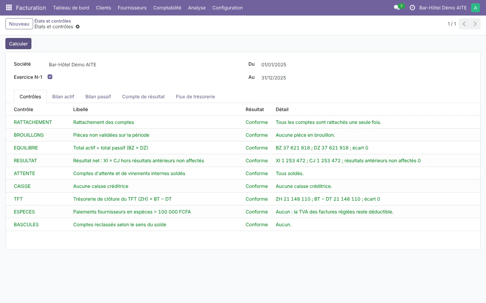

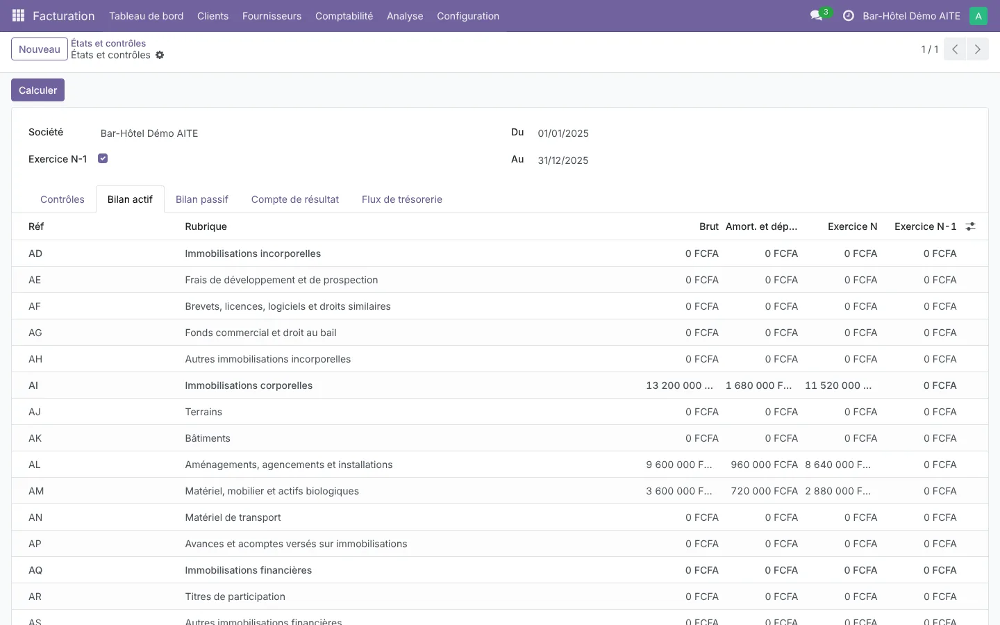

### Les 9 contrôles

Aucun niveau ne bloque une saisie dans Odoo : les niveaux guident l'arrêté des comptes. Un Bloquant se corrige avant d'arrêter les comptes, une Alerte se corrige ou se justifie par écrit, une Information se lit.

| Code | Libellé | Niveaux | Ce qui est vérifié | Que faire s'il n'est pas vert |
| --- | --- | --- | --- | --- |
| RATTACHEMENT | Rattachement des comptes | Conforme, Alerte, Bloquant | Chaque compte est capté une fois au débit et une fois au crédit par le bilan ; chaque compte 6, 7 ou 8 une fois par le compte de résultat | Bloquant « Comptes mouvementés non rattachés » : corriger le code du compte ou faire évoluer le référentiel. Alerte « Comptes non rattachés (sans mouvement) » : peut attendre |
| BROUILLONS | Pièces non validées sur la période | Conforme, Alerte | Pièces en brouillon datées de la période | Valider ou supprimer ces pièces |
| EQUILIBRE | Total actif = total passif (BZ = DZ) | Conforme, Bloquant | Égalité des deux totaux du bilan | Corriger d'abord RATTACHEMENT |
| RESULTAT | Résultat net : XI = CJ hors résultats antérieurs non affectés | Conforme, Bloquant | Résultat du compte de résultat égal à celui du bilan | Vérifier qu'aucun compte 13 ou 999999 n'a servi à une opération courante |
| AFFECTATION | Résultats antérieurs à affecter | Alerte | Si RESULTAT est Conforme, des résultats antérieurs restent en CJ | Passer l'écriture d'affectation |
| ATTENTE | Comptes d'attente et de virements internes soldés | Conforme, Alerte | Soldes de 471, 585, 588, du compte d'attente bancaire et du compte de virements internes | Justifier et solder chaque compte listé |
| CAISSE | Aucune caisse créditrice | Conforme, Bloquant | Aucun compte 57 à solde créditeur | Chercher la recette manquante à la date du passage en négatif |
| TFT | Trésorerie de clôture du TFT (ZH) = BT − DT | Conforme, Bloquant | Trésorerie du tableau des flux égale à celle du bilan | Avec EQUILIBRE et RESULTAT verts, signaler l'écart : il relève des formules de flux |
| ESPECES | Paiements fournisseurs en espèces > 100 000 FCFA | Conforme, Alerte | Paiements fournisseurs sortants sur un journal de type Espèces au-delà de 100 000 | Le code tient la TVA de ces factures pour non déductible ; règle à faire confirmer par l'expert-comptable |
| BASCULES | Comptes reclassés selon le sens du solde | Conforme, Information | Comptes 40 débiteurs hors 409, 41 créditeurs hors 419, 52 et 53 à découvert | Vérifier qu'il s'agit d'un trop-perçu, d'une avance ou d'un découvert réel |

### Les états MIS Builder en Community

Chaque menu Bilan actif, Bilan passif, Compte de résultat et Tableau des flux de trésorerie ouvre l'aperçu d'une instance MIS Builder. L'instance est créée au premier clic pour la société courante, puis réutilisée. Elle porte deux colonnes, « Exercice N » et « Exercice N-1 », années civiles relatives à la date de référence de l'instance (par défaut l'année en cours).

Pour éditer un exercice clos :

1. Ouvrir Facturation > Analyse > MIS Reporting > MIS Reports, puis l'instance voulue.
2. Dans l'onglet « Colonnes », renseigner « Date de référence » avec une date de l'exercice voulu.
3. Cliquer sur « Prévisualisation ». Vider le champ pour revenir à l'année en cours.

Les boutons de l'aperçu sont ceux de MIS Builder : « Imprimer » produit le PDF, « Export » le fichier Excel. Ne pas supprimer ni renommer les instances créées par les menus Syscohada.


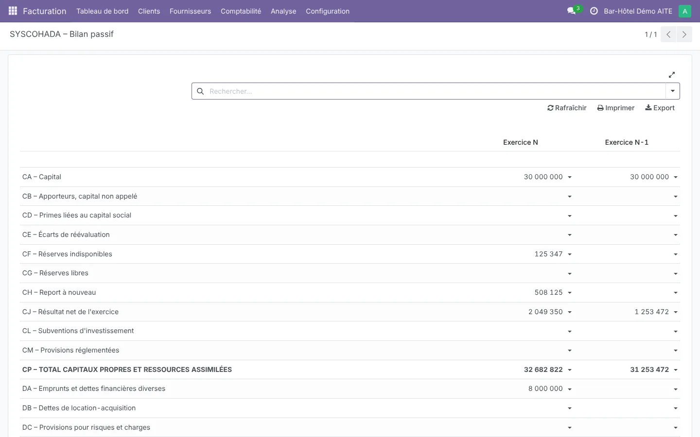

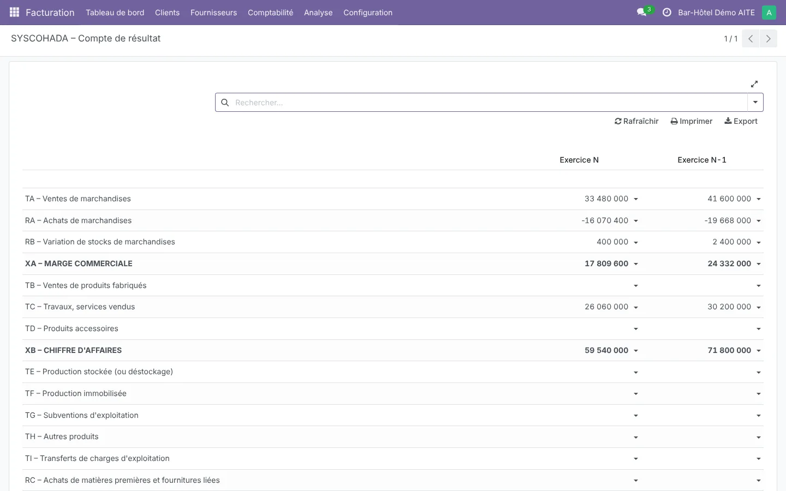


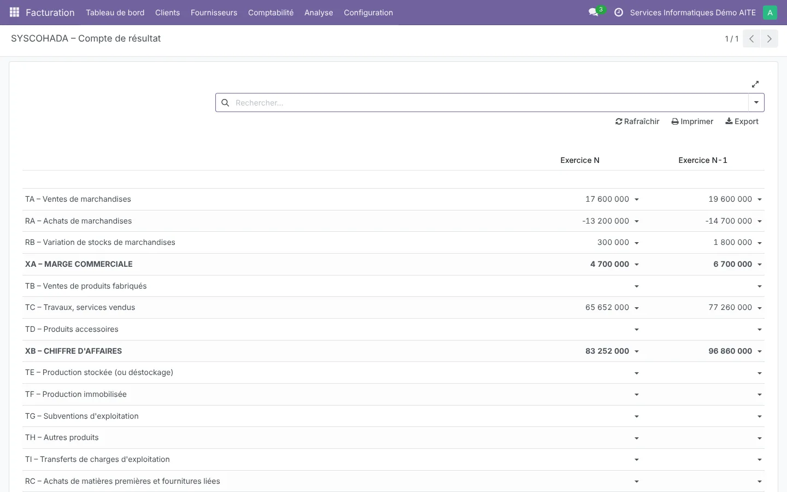

**Limite connue** : le TFT MIS ne neutralise pas les virements internes entre comptes d'immobilisations. Une mise en service (débit 2441, crédit 2491) gonfle FG dans MIS, pas dans l'assistant. En cas d'écart entre MIS et l'assistant, l'assistant fait foi.

### Les rapports Enterprise

Le module `aite_syscohada_reports` ajoute les quatre états au moteur de rapports d'Odoo Enterprise ; il s'installe automatiquement quand `account_reports` est présent.

| Rapport | Colonnes | Filtre de date |
| --- | --- | --- |
| SYSCOHADA – Bilan actif | Brut, Amort. et dépréc., Net | Date unique |
| SYSCOHADA – Bilan passif | Net | Date unique |
| SYSCOHADA – Compte de résultat | Net | Période |
| SYSCOHADA – Tableau des flux de trésorerie | Montant | Période |

Le fichier XML de ces rapports se régénère depuis le référentiel, jamais à la main (voir Développement). Sur une base Enterprise réelle, l'outil `tools/compare_with_engine.py` compare chaque rubrique au moteur :

```bash
COMPANY_ID=1 DATE_FROM=2025-01-01 DATE_TO=2025-12-31 odoo-bin shell -d <base> --no-http < addons/aite_syscohada_reports/tools/compare_with_engine.py
```

Les rapports Enterprise partagent la limite du TFT MIS sur les virements internes.

### Lire les rubriques

Le référentiel compte 124 rubriques, chacune avec un code de deux lettres, un libellé et une formule.


| État | Codes | Nombre | Sous-totaux et totaux |
| --- | --- | --- | --- |
| Bilan actif | AD à BZ | 29 | AD, AI, AQ, AZ, BG, BK, BT, BZ |
| Bilan passif | CA à DZ | 28 | CP, DD, DF, DP, DT, DZ |
| Compte de résultat | TA à XI | 42 | XA, XB, XC, XD, XE, XF, XG, XH, XI |
| Tableau des flux de trésorerie | ZA à ZH | 25 | ZB, ZC, ZD, ZE, ZF, ZG, ZH |

**Signes** : un produit, un passif et une entrée de trésorerie s'affichent en positif ; une charge, une perte et une sortie de trésorerie en négatif. Un achat de marchandises de 800 000 donne RA à −800 000. Le classeur DSF attend les charges en positif : la colonne « Signe DSF » du référentiel vaut −1 sur ces lignes.

**Bascules selon le sens du solde** : un compte est classé compte par compte, selon le signe de son solde à la date du bilan.

| Comptes | Solde débiteur | Solde créditeur |
| --- | --- | --- |
| 40 | BH Fournisseurs, avances versées | DJ Fournisseurs d'exploitation |
| 41 | BI Clients | DI Clients, avances reçues |
| 42, 43, 44 | BJ Autres créances | DK Dettes fiscales et sociales |
| 18 hors 181 à 184, 45, 46, 47 hors 478 et 479 | BJ Autres créances | DM Autres dettes |
| 48 | BA Actif circulant HAO | DH Dettes circulantes HAO |
| 52, 53, 54, 55, 57, 58 | BS Banques, caisse et assimilés | DR Crédits de trésorerie |

Les comptes 564 et 565 vont toujours en DQ, 478 en BU, 479 en DV. La bascule se fait au niveau du compte, pas client par client : un compte 411100 globalement débiteur reste entier en BI.

**Rubrique CJ et compte 999999** : la formule de CJ est `-13-6-7-8-999999`. Odoo ne solde jamais les comptes de charges et de produits ; le transfert du résultat N-1 vers la classe 13 passe par 999999 « Profits/pertes non distribués ». Une fois ce transfert passé, il reste dans CJ le résultat de l'exercice et les comptes 13 non encore affectés. Ne jamais imputer une opération courante sur 999999.

## 6. Déclaration mensuelle I/TVA-IR

Une déclaration par mois, créée dans Facturation > Analyse > Syscohada > Déclarations de TVA (Cameroun), calcule les lignes L0 à L80 depuis les écritures comptabilisées, passe l'écriture de liquidation et imprime un document de travail pour le portail de la DGI. Lecture réservée au groupe `account.group_account_readonly` ; création, calcul et validation réservés à `account.group_account_manager`. Dans cette section, 4441 désigne le compte 444100.

### Créer la déclaration

1. Cliquer sur Nouveau.
2. Vérifier « Du » et « Au ». Par défaut : premier et dernier jour du mois précédent.
3. Enregistrer. Le nom est calculé, par exemple `TVA 2026-03-01 – 2026-03-31`.

Deux contrôles bloquent l'enregistrement : « La date de début doit précéder la date de fin. » et « Une déclaration existe déjà pour cette période. ». Le code n'impose pas la durée d'un mois et ne bloque pas les périodes qui se chevauchent.

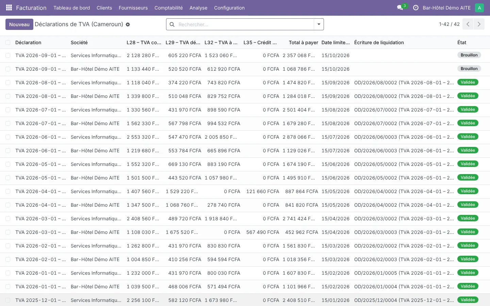

### Onglet « Saisies du déclarant »

Ces champs restent modifiables tant que la déclaration est en brouillon.

| Champ | Rôle | Défaut |
| --- | --- | --- |
| « L17 – Crédit antérieur » | Repris du L35 de la dernière déclaration validée. Modifiable. Voir la mise en garde plus bas | L35 repris, sinon 0 |
| « L34 – Remboursement demandé » | Retranché du crédit L33 pour donner L35 | 0 |
| « Taux de l'acompte sur CA (%) » | Taux de la ligne L50 | 2,0 |
| « Centimes additionnels communaux (%) » | CAC des lignes L50, L51, L56 à L61, L63 à L65 | 10,0 |
| « L11 – Droits d'accises (base) » et « (taxe) » | Ligne L11, entre dans L15 et L28 | 0 |
| « L24 » à « L27 » | Régularisations, reprises en L30 (L24 + L25) et L31 (L26 + L27) | 0 |
| « Compte de contrepartie des régularisations » | Compte mouvementé par la liquidation pour L11 et L24 à L27 | vide |

### Bouton « Calculer »

« Calculer » remplit les onglets « Déclaration I/TVA-IR » et « Retenues, acomptes, IRCM, salaires ». Pour la TVA, il lit :

1. La définition officielle du rapport de TVA `l10n_cm.account_tax_report_cm`, présente dans Odoo Community. Chaque ligne L10 à L35 y porte un code, par exemple `CM_NORMAL` pour L10.
2. Les lignes d'écritures comptabilisées de la période portant des étiquettes de taxe et exigibles. La TVA des prestations à l'encaissement n'entre qu'au paiement ; en attendant, elle reste en 443800.
3. Les saisies du déclarant pour L11, L17, L24 à L27 et L34.
4. Les formules d'agrégation de la DGI ; L32, L33 et L35 sont plancherées à zéro.

Les résultats remontent dans l'en-tête : « L28 – TVA collectée », « L29 – TVA déductible », « L32 – TVA à payer », « L33 – Crédit de TVA », « L35 – Crédit à reporter », « L54 – Acompte à payer » et « Total à payer ». Sur une déclaration validée, le calcul est refusé : « Déclaration validée : remettez-la en brouillon pour la recalculer. »


### Onglet « Déclaration I/TVA-IR » : lignes L10 à L35

| Code | Ligne | Provenance |
| --- | --- | --- |
| `CM_NORMAL` | 10. Opérations taxables au taux normal | Taxes de vente « 19.25% » et « 19,25 % S (encaissement) » |
| `CM_EXCISE` | 11. Montant du Droit d'Accises | Saisies L11 |
| `CM_OTHER` | 12. Autres opérations taxables | Aucune taxe livrée ne la porte |
| `CM_EXPORT` | 13. Exportations | Taxe de vente « 0% EX » |
| `CM_EXEMPT` | 14. Chiffre d'affaires exonéré | Taxe de vente « 0% » |
| `CM_GLOBAL` | 15. CA global hors taxes | L10 + L11 + L12 + L13 + L14 ; base de l'acompte L50 |
| `CM_CREDIT_REPORTED` | 17. Report du crédit antérieur | Champ « L17 – Crédit antérieur » |
| `CM_LOCAL_PURCHASE` | 18. TVA déductible sur achats locaux | « 19.25% G » (4452) et « 19,25 % I » (4451) |
| `CM_LOCAL_SERVICE` | 19. TVA déductible sur services locaux | « 19.25% S » (4454) |
| `CM_FOREIGN_PURCHASE` | 20. TVA déductible sur achats à l'étranger | Aucune taxe livrée ne la porte |
| `CM_FOREIGN_SERVICE` | 21. TVA déductible sur services versés à l'étranger | Taxe d'autoliquidation, inactive par défaut |
| `CM_DEDUCTIBLE_VAT` | 22. Total TVA déductible | L17 + L18 + L19 + L20 + L21 |
| `CM_ADJUSTMENT_DEDUCTIBLE` à `CM_ADJUSTMENT_OTHER` | 24 à 27. Régularisations | Saisies L24 à L27 |
| `CM_COLLECTED` | 28. TVA collectée | L10 + L11 + L12 |
| `CM_DEDUCTIBLE_VAT_29` | 29. TVA déductible | L22 |
| `CM_VAT_TO_PAY` | 32. TVA à payer | L28 − L29 − L30 + L31, plancher à zéro |
| `CM_CREDIT` | 33. Crédit de TVA | L29 + L30 − L28 − L31, plancher à zéro |
| `CM_REIMBURSEMENT` | 34. Remboursement demandé | Saisie L34 |
| `CM_CREDIT_REPORT` | 35. Crédit à reporter | L33 − L34 ; repris en L17 le mois suivant |

### Onglet « Retenues, acomptes, IRCM, salaires »

Cet onglet porte les 54 lignes du formulaire hors TVA (liste complète en annexe). Les lignes sont créées au premier « Calculer » et conservées ensuite : les saisies survivent au recalcul. Colonnes de saisie : « Base saisie », « Taux ou tarif », « Montant saisi », « Pénalités ». Colonnes calculées : « Base », « Principal », « CAC », « Total », avec Total = Principal + CAC + Pénalités.

| Nature | Calcul du principal | Saisie possible |
| --- | --- | --- |
| credit | Somme des crédits de la période sur le compte dédié (L0, L37, L38, L40 à L43, L67 à L72) | « Pénalités » |
| debit | Somme des débits de la période sur le compte dédié (L45 à L48) | Aucune |
| manual | « Base saisie » × « Taux ou tarif » / 100 | Base, taux, pénalités |
| manual\_unit | « Base saisie » × « Taux ou tarif » (timbre d'aéroport) | Base, tarif, pénalités |
| manual\_amount | « Montant saisi » | Montant, pénalités |
| acompte | Base L15 (ou « Base saisie ») × taux de l'acompte / 100, base plancherée à zéro | Base, pénalités |
| vat | « L32 – TVA à payer » | Aucune |
| carry | « Montant saisi », sinon L55 de la déclaration validée précédente | Montant, pénalités |
| formula | Combinaison des totaux précédents | Aucune |

Section 9 : L54 = max(L50 + L51 − L52 − L53, 0) et L55 = max(L52 + L53 − L50 − L51, 0), avec L52 = L49. Le report L55 vers L53 n'a lieu que depuis une déclaration validée et il est recherché à chaque calcul. La ligne TOTAL additionne L0 + L8 + L39 + L44 + L54 + L62 + L66 + L73 + L77 + L80 ; L49 n'y entre pas, car elle est déjà déduite dans L54.

Aucune taxe n'alimente L41 : la ligne ne bouge que par des écritures manuelles au crédit de 447180. La section 12 attend des écritures de paie au crédit de 447210 à 447260.

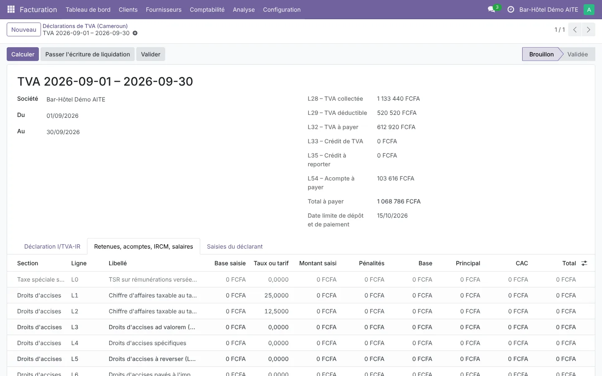


### Bouton « Passer l'écriture de liquidation »

Le bouton recalcule la déclaration, puis génère et comptabilise l'écriture de clôture de TVA et d'acompte, ouverte ensuite par le bouton « Écriture ».

| Compte | Sens | Montant |
| --- | --- | --- |
| Chaque compte 443 et 445 portant des lignes de taxe exigibles, hors 443800 | Inverse du solde de la période | Solde du mois |
| 4449 | Crédit | L17, crédit antérieur imputé |
| 4441 | Crédit | L32 |
| 4449 | Débit | L35 |
| 4445 | Débit | L34 |
| Compte de contrepartie | Débit si positif, crédit sinon | L11 taxe + L26 + L27 − L24 − L25 |
| 449250 / 441100 | Débit / crédit | L54 |

L'écriture est datée du dernier jour de la période, sur le premier journal de type « Divers » de la société. Les comptes de retenue 447 et 449 ne sont pas touchés.

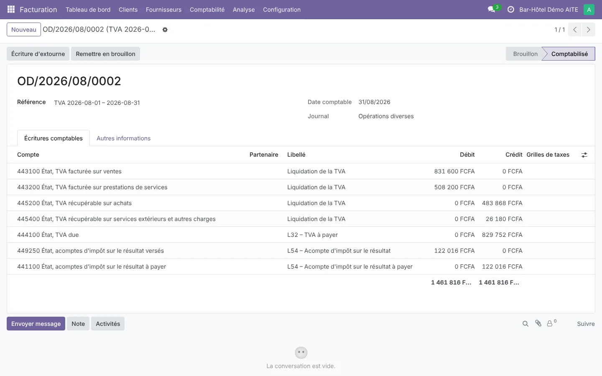

| Situation | Message |
| --- | --- |
| Une écriture est déjà liée | « L'écriture de liquidation existe déjà. » |
| Comptes 4441, 4449 ou 4445 absents | « Comptes 4441, 4449 ou 4445 introuvables. » |
| Les lignes de TVA ne s'équilibrent pas avec la déclaration | « Écart de … entre le grand livre et la déclaration : vérifiez les étiquettes de taxe. » |
| Régularisation sans compte de contrepartie | « Renseignez le compte de contrepartie des régularisations (L11, L24 à L27). » |
| Acompte à payer et comptes 449250 ou 441100 absents | « Comptes 449250 ou 441100 introuvables : appliquez le paramétrage SYSCOHADA. » |
| Rien à écrire | « Rien à liquider pour cette période. » |

### « Valider », « Remettre en brouillon » et impression

« Valider » passe la déclaration à « Validée » sans recalculer si des lignes existent déjà : cliquer sur « Calculer » avant de valider. La déclaration devient alors la source de L17 et de L53 pour le mois suivant. « Remettre en brouillon » est refusé si une déclaration ultérieure est validée : « Une déclaration ultérieure est validée : son crédit antérieur dépend de celle-ci. » Le retour en brouillon ne touche pas l'écriture de liquidation.

Le rapport « Déclaration I/TVA-IR », dans le menu Imprimer, reprend la période, le NIU, la date limite, le tableau TVA, un tableau par section et le « TOTAL À PAYER ». Il porte la mention : « Document de travail établi par Odoo pour la saisie de la déclaration sur le portail de la DGI ; il ne remplace pas la déclaration officielle. » La « Date limite de dépôt et de paiement » vaut le 15 du mois qui suit la fin de période.

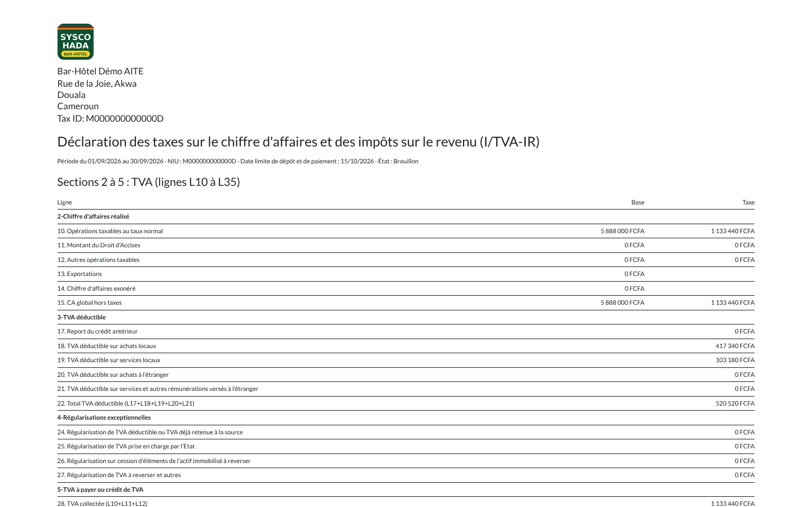

### Défauts connus, mis en évidence par les tests avancés

- **L17 non repris si le mois suivant existe déjà.** « L17 – Crédit antérieur » n'est calculé qu'à la création de la déclaration. Si avril est créée avant la validation de mars, avril garde 0, même après « Calculer ». Aucun contrôle ne le signale. Contournement : valider chaque mois avant de créer le suivant, ou saisir L17 à la main puis cliquer sur « Calculer ». L53 n'a pas ce défaut.
- **Retenues surestimées après une extourne dans le mois.** Une ligne credit additionne les seuls crédits du compte : le débit d'une extourne n'est pas déduit. Exemple testé : honoraires de 1 000 000 et de 400 000 avec retenue, la seconde facture extournée. L43 affiche 70 000 sur une base de 1 800 000 au lieu de 50 000 sur 1 000 000. Avant de reporter ces lignes sur le portail, les comparer au solde du compte sur la période.
- **Liquidation lancée depuis une autre société.** En multi-sociétés, si la société courante n'est pas celle de la déclaration, la liquidation est refusée par un « Écart … ». Contournement : sélectionner la société déclarante avant de liquider.

### Exemple chiffré : mars 2026, formulaire complet

Scénario du test `test_march_full_form`, taxes de retenue activées pour le test.

| Date | Pièce | Montant HT | Taxes | Effet comptable |
| --- | --- | --- | --- | --- |
| 05/03 | Facture client | 2 000 000 | « 19.25% » | 385 000 au crédit de 4431 |
| 06/03 | Facture client | 1 000 000 | « 19.25% » et acompte retenu par le client | 192 500 au crédit de 4431 ; 20 000 au débit de 449220 |
| 07/03 | Loyer | 500 000 | Précompte sur loyers retenu | 75 000 au crédit de 447130 |
| 08/03 | Honoraires | 200 000 | Retenue sur honoraires | 10 000 au crédit de 447140 |
| 09/03 | Achats | 1 000 000 | « 19.25% G » et précompte sur achats | 192 500 au débit de 4452 ; 20 000 au débit de 449210 |
| 31/03 | Paie | 1 000 000 | aucune | 447210 100 000, 447215 10 000, 447220 10 000, 447250 2 000, 447260 1 000 |
| 31/03 | Charges patronales | 25 000 | aucune | 447230 15 000, 447240 10 000 |

Après un premier « Calculer », le déclarant saisit une « Base saisie » de 1 000 000 sur L57 (dividendes), puis recalcule.

| Ligne | Base | Principal | CAC | Total |
| --- | --- | --- | --- | --- |
| L10 / L28 | 3 000 000 | 577 500 |  |  |
| L18 / L29 |  | 192 500 |  |  |
| L32 = L36 = L39 |  | 385 000 |  | 385 000 |
| L42 | 500 000 | 75 000 | 0 | 75 000 |
| L43 | 200 000 | 10 000 | 0 | 10 000 |
| L44 |  | 85 000 |  | 85 000 |
| L45 + L46 = L49 = L52 |  | 40 000 |  | 40 000 |
| L50 | 3 000 000 | 60 000 | 6 000 | 66 000 |
| L54 |  | 26 000 |  | 26 000 |
| L57 = L62 | 1 000 000 | 150 000 | 15 000 | 165 000 |
| L67 |  | 100 000 | 10 000 | 110 000 |
| L73 |  | 148 000 |  | 148 000 |
| TOTAL |  |  |  | 809 000 |

Le total vaut 385 000 + 85 000 + 26 000 + 165 000 + 148 000 = 809 000, à payer le 15 avril 2026. L'écriture de liquidation débite 4431 de 577 500 et 449250 de 26 000 ; elle crédite 4452 de 192 500, 4441 de 385 000 et 441100 de 26 000.

### Exemple de crédit de TVA reporté : mars puis avril 2026

Scénario du test `test_march_credit_then_april_payable`. En mars : ventes de biens 1 000 000, prestation de 200 000 payée et de 400 000 impayée, export 300 000, exonéré 100 000, achats 600 000, services 100 000, immobilisation 1 000 000.

| Ligne | Mars | Avril | Calcul |
| --- | --- | --- | --- |
| L10 base | 1 200 000 | 2 400 000 | Mars : biens + prestation payée. Avril : vente 2 000 000 + prestation de mars encaissée |
| L10 taxe = L28 | 231 000 | 462 000 | 19,25 % |
| L17 | 0 | 96 250 | L35 de mars repris |
| L18 | 308 000 | 96 250 | Mars : 115 500 + 192 500 |
| L19 | 19 250 | 0 | Services |
| L29 | 327 250 | 192 500 | L17 + L18 + L19 |
| L32 | 0 | 269 500 | 462 000 − 192 500 |
| L33 = L35 | 96 250 | 0 | 327 250 − 231 000 |

En mars, l'écriture solde 4431, 4432, 4451, 4452 et 4454 et porte 96 250 au débit de 4449 ; 443800 garde 77 000, la TVA de la prestation impayée. En avril, elle impute le crédit (4449 au crédit pour 96 250) et crédite 4441 de 269 500.

## 7. Clôture d'exercice et préparation de la DSF

### Ordre des travaux de clôture

La clôture suit un ordre fixe : chaque étape alimente la suivante et l'impôt se calcule en dernier. Les écritures sont datées du 31 décembre dans un journal d'opérations diverses ; les numéros ci-dessous sont des préfixes.

1. **Inventaires.** Compter les stocks, les caisses et les immobilisations. En inventaire intermittent, annuler le stock initial (débit 6031, crédit 31) puis constater le stock final (débit 31, crédit 6031). Le contrôle CAISSE doit être vert.
2. **Rattachements.** Factures non parvenues : débit de la charge et de 4455, crédit 408. Factures à établir : débit 418, crédit du produit et de 4435. Charges constatées d'avance : débit 476. Produits constatés d'avance : crédit 477. Chaque écriture est extournée au 1er janvier suivant.
3. **Amortissements et dépréciations.** Dotation : débit 681, crédit 28. Créance douteuse : reclassement en 416, puis débit 659 et crédit 491. Stock déprécié : débit 659, crédit 39.
4. **Justification des comptes.** Rapprocher les banques, lettrer clients et fournisseurs, solder 471, 585 et 588. Les contrôles ATTENTE et BROUILLONS doivent être verts.
5. **Impôt sur le résultat.** Calculer le résultat fiscal puis l'impôt : débit 891, crédit 441. Les modules ne calculent pas encore l'impôt (lot 3). Les acomptes mensuels, passés par la liquidation (débit 449250, crédit 441100), s'imputent par écriture manuelle.
6. **Contrôles.** Lancer États et contrôles (AITE) sur l'exercice, « Exercice N-1 » coché : aucun Bloquant, chaque Alerte justifiée par écrit.
7. **Verrouillage.** Poser les dates de verrouillage décrites ci-dessous.
8. **Affectation du résultat**, après l'assemblée, dans l'exercice suivant (voir la saisie quotidienne).

### Dates de verrouillage

Odoo 18 porte cinq dates de verrouillage sur la société : TVA, ventes, achats, globale et verrou définitif (irréversible, à poser après le dépôt de la DSF). Odoo 18 Community n'offre aucun écran pour les saisir et les modules AITE n'en ajoutent pas. Le module OCA `account_lock_date_update` (dépôt account-financial-tools, branche 18.0) couvre les cinq dates et ajoute le menu Facturation > Comptabilité > Lock Dates. Poser la date de verrouillage de la TVA après chaque déclaration mensuelle validée, et la date globale au 31 décembre une fois les états arrêtés.

### Lien avec la DSF

L'assistant fournit dès aujourd'hui les quatre états en colonnes Exercice N et Exercice N-1 : ce sont les valeurs à reporter dans les onglets BILAN PAYSAGE, COMPTE DE RESULTAT et TABLEAU DES FLUX DE TRESORERIE du classeur DSF. Chaque rubrique du référentiel connaît sa cellule (champs « Onglet DSF », « Cellule N », « Cellule N-1 », « Signe DSF »). Deux codes diffèrent dans le classeur : BG y est codé BC et DV y est codé DY. Le classeur attend les charges en positif, l'assistant les affiche en négatif.

Le remplissage automatique du classeur et les notes annexes sont les lots 3 et 4 de la feuille de route, non livrés. Le relevé `docs/dsf/Releve_classeur_DSF_Normal_2021.xlsx` décrit la version du 9 mars 2021 : 74 onglets, 4 435 cellules dont 3 215 à saisir, 104 liens états-notes et 18 anomalies de formules.

**Ne jamais utiliser le classeur comme référence de calcul.** Principales anomalies relevées :

| Onglet | Cellules | Constat |
| --- | --- | --- |
| BILAN PAYSAGE | E13:E16 | Amortissements des incorporels lus dans les dotations de l'exercice au lieu du cumul |
| BILAN PAYSAGE | K23:K25 | DA, DB, DC lus dans la note 15A au lieu de la note 16A |
| BILAN PAYSAGE | K40 | DZ sans l'écart de conversion-passif |
| COMPTE DE RESULTAT | E13 | RB calculé sur tous les stocks |
| COMPTE DE RESULTAT | E43 | XF additionne RM et RN au lieu de les soustraire |
| NOTE 34 | B36 | CAFG incomplète |
| CF1, CF1 BIS | libellés | Taux d'IS « 30 % ou 28 % », antérieur au barème en vigueur |

Les montants viennent du moteur ; tout écart avec une formule du classeur se documente, sans modifier le moteur pour le reproduire.

### Échéances de dépôt

| Obligation | Échéance | Appui dans les modules |
| --- | --- | --- |
| Déclaration mensuelle I/TVA-IR et paiement | Le 15 du mois suivant | Calculée par la déclaration |
| DSF et solde de l'IS, contribuables de la DGE | 15 mars | États N et N-1 de l'assistant |
| DSF, contribuables des CIME | 15 avril | Idem |
| DSF, contribuables des CDI | 15 mai | Idem |

Ces échéances et le taux d'IS (30 %, ou 25 % si le chiffre d'affaires ne dépasse pas 3 milliards, plus 10 % de CAC) viennent du skill `fiscalite-cameroun` du dépôt. La loi de finances peut les changer : les vérifier sur impots.cm en début d'exercice.

## 8. Tests

La suite complète passe sur Odoo 18 Community (8 octobre 2026, version 18.0.1.3.1, base neuve) : 108 tests, 0 échec, 0 erreur, dont 3 échecs attendus qui décrivent des défauts connus du module. Le test de volume, lancé à part sur une base neuve, passe en 39 secondes.

| Ensemble | Tests | Résultat | Durée |
| --- | --- | --- | --- |
| Suite de référence (modules base, mis, community) | 66 | 0 échec | incluse ci-dessous |
| Tests avancés `test_adv_*.py` hors volume | 42 | 0 échec, 3 échecs attendus | inclus ci-dessous |
| Suite complète (référence et avancés) | 108 | 0 échec | 250 s |
| Volume (étiquette `aite_syscohada_volume`) | 1 | 0 échec | 39 s |
| Données de démonstration (étiquette `aite_syscohada_demo`, base où les deux modules sont installés) : 15 pour le bar-hôtel, 19 pour les services informatiques | 34 | 0 échec | 7 s, après 110 s d'installation |

### Les tests avancés ajoutés

| Fichier | Tests | Ce qui est vérifié, montants calculés à la main |
| --- | --- | --- |
| `test_adv_bar_hotel_year.py` | 8 | Exercice complet d'un bar-hôtel sur deux ans : comptoir, hébergement sur encaissement, consignes, ristournes, paie, stocks, emprunt, affectation. Compte de résultat (XI 150 000), bilan (BZ = DZ = 33 598 750), TFT (ZH 23 689 000 = BT − DT), 9 contrôles verts, égalité moteur et MIS en N et N-1 |
| `test_adv_declaration_sequence.py` | 4 | Quatre déclarations enchaînées de janvier à avril : crédits de TVA et d'acompte reportés, prestation payée en deux fois, avoir, immobilisation, remboursement L34, soldes des neuf comptes de TVA après chaque liquidation, ordre de saisie, remise en brouillon |
| `test_adv_withholding_mixed.py` | 11 | Factures avec retenues opérées et subies, autoliquidation et TSR, précompte, extourne : lignes d'écriture exactes, lignes L0 à L55, bases de taxe, total à payer |
| `test_adv_multi_company.py` | 11 | Deux sociétés camerounaises et une belge : paramétrage par société, isolation des calculs et des déclarations, sous-comptes à sept chiffres, compte hors plan signalé |
| `test_adv_closing_lifecycle.py` | 8 | Écriture de liquidation au compte près, messages d'erreur exacts, validation et remise en brouillon, date limite, crédit antérieur saisi, régularisation L27, compte 443800 jamais touché |
| `test_adv_volume.py` | 1 | 450 factures et 3 000 lignes de vente en un mois : déclaration et liquidation exactes dans les deux modes d'arrondi ; calcul de la déclaration en 0,23 s et des états en 0,05 s |

### Défauts mis en évidence

Les trois défauts sont décrits par des tests en échec attendu : l'assertion décrit le comportement correct, et le test échouera exprès le jour où le défaut sera corrigé, pour rappeler de retirer le décorateur.

| Défaut | Test | Effet | Correction proposée |
| --- | --- | --- | --- |
| L17 non recalculé | `test_order_of_entry_vat_credit` | Si avril est créée avant la validation de mars, le crédit de TVA de mars n'est pas reporté : TVA d'avril surévaluée | Recalculer le crédit antérieur à chaque « Calculer », refuser la validation si le mois précédent est en brouillon |
| Extourne ignorée dans les retenues | `test_may_l43_excludes_reversed_invoice` | L43 à 70 000 au lieu de 50 000 après une facture d'honoraires extournée | Lire le solde net du compte ou exclure les pièces extournées |
| Liquidation depuis une autre société | `test_closing_entry_of_b_from_company_a_context` | « Écart de 96250.0 … » : la recherche par code de compte dépend de la société courante | Filtrer par les comptes de la société de la déclaration dans `_closing_balances` |

### Lancer les tests

```bash
# suite complète (référence et tests avancés)
scripts/run_tests.sh aite_dev aite_syscohada_base,aite_syscohada_mis,aite_syscohada_community
# tests avancés seuls
scripts/run_tests.sh aite_dev aite_syscohada_community aite_syscohada_advanced
# volume, sur une base neuve
createdb -T aite_dev aite_volume
scripts/run_tests.sh aite_volume aite_syscohada_community aite_syscohada_volume
# données de démonstration (bar-hôtel et services informatiques) : installation puis tests
createdb -T aite_dev aite_demo
../venv/bin/python ../odoo18/odoo-bin -c odoo.conf -d aite_demo -i aite_syscohada_demo,aite_syscohada_demo_services --stop-after-init
scripts/run_tests.sh aite_demo aite_syscohada_demo,aite_syscohada_demo_services aite_syscohada_demo
# base des captures d'écran du guide (français, deux sociétés), puis captures avec un serveur Odoo démarré dessus
scripts/guide/prepare_db.sh aite_guide
node scripts/guide/capture.js http://127.0.0.1:8069 <dossier des PNG>
python scripts/guide/convert_captures.py <dossier des PNG> docs/guide/captures
python scripts/guide/build_guide.py docs/guide/guide.md docs/guide-syscohada-odoo18.html
```

L'intégration continue GitHub Actions exécute à chaque push la suite complète, le test de volume, l'installation et les tests des données de démonstration, construit le zip d'installation (artefact « paquet-odoo18 », que GitHub enveloppe dans son propre zip), puis l'installe sur une base neuve avec le seul dossier `addons/` du paquet dans `addons_path`, comme chez un client. Les résultats se lisent dans l'onglet Actions du dépôt.

## 9. Développement

### Architecture et flux de données

Tous les états viennent d'un seul référentiel de 124 rubriques. Chaque rendu le lit, aucun ne le recopie.

| Étape | Fichier ou objet | Rôle |
| --- | --- | --- |
| 1. Source | `addons/aite_syscohada_base/tools/gen_rubriques.py` | Listes `ACTIF`, `PASSIF`, `RESULTAT` et `FLUX` : code, libellé, type, formules, note, ligne du classeur DSF |
| 2. Données | `addons/aite_syscohada_base/data/aite.syscohada.rubrique.csv` | Chargé dans `aite.syscohada.rubrique` à l'installation et à chaque mise à jour du socle |
| 3. Moteur | `syscohada_engine.compute(company, date_from, date_to)` | Calcul de référence en Python pur : clés `actif`, `passif`, `resultat`, `flux` |
| 4a. Assistant | `wizard/syscohada_statement_wizard.py` | Moteur pour N et N-1, puis les 9 contrôles de `syscohada_check.py` |
| 4b. MIS | `aite_syscohada_mis/models/mis_report.py` | `_aite_syscohada_build()` traduit chaque formule en expression MIS |
| 4c. Enterprise | `aite_syscohada_base/models/syscohada_enterprise.py` | `generate_xml()` produit `aite_syscohada_reports/data/syscohada_reports.xml` |

La déclaration mensuelle suit un autre chemin : `vat_declaration.py` lit le rapport de TVA officiel de `l10n_cm`, `itvair.py` lit les comptes de retenue créés par le socle. Les tests comparent chaque rendu au moteur : scénario chiffré à la main (`test_statements.py`), grands livres aléatoires (`test_tft_properties.py`), MIS (`test_mis_templates.py`), XML Enterprise émulé (`test_enterprise_xml.py`) et `account.report` sur Enterprise (`test_enterprise_reports.py`).

### Syntaxe des formules

Une formule de comptes suit la syntaxe `account_codes` d'Enterprise : `[signe] préfixe [\(exclusion1,exclusion2)] [D|C]`.

| Élément | Exemple tiré du CSV | Effet |
| --- | --- | --- |
| Préfixes additionnés | AE brut : `211+2181+2191` | Somme des soldes des comptes commençant par 211, 2181 ou 2191 |
| Signe moins | CA : `-101-102-103-104` | Au passif et au résultat, les soldes créditeurs s'affichent en positif |
| Exclusions | AM brut : `24\(245,2495)` | Comptes 24 sauf 245 et 2495 |
| Suffixe `D` | BA brut : `48D` | Seuls les comptes 48 à solde débiteur, compte par compte |
| Suffixe `C` | DJ : `-40C` | Seuls les comptes 40 à solde créditeur |
| Actif en deux formules | AH : brut `217+218\(2181)+2198`, amortissements `2817+…` | Net = brut − amortissements |

Les agrégations additionnent les rubriques d'un même état : `AE+AF+AG+AH` (AD), `ZA+ZG` (ZH). Le TFT utilise des termes signés `TYPE:ARGUMENT` :

| Type | Argument | Valeur | Exemple du CSV |
| --- | --- | --- | --- |
| `R:` | Rubrique du compte de résultat | Montant de la période | FA : `R:XI+P:681+…` |
| `B:` / `B0:` | Rubrique de bilan | Montant à la clôture / à l'ouverture | ZA : `B0:BT-B0:DT` |
| `V:` | Rubrique de bilan | `B` − `B0` | FC : `-V:BB` |
| `P:` | Comptes | Solde de la période | FA : `P:681` |
| `E:` / `S:` | Comptes | Solde de clôture / d'ouverture | FB : `-V:BA+E:485-S:485` |
| `D:` / `C:` | Comptes | Débits / crédits de la période | FN : `-D:465` ; FL : `C:14` |
| `DX:` / `CX:` | Comptes | Idem hors virements internes au groupe | FF : `-DX:(21+251)-E:4811+S:4811` |

Un argument de plusieurs termes se met entre parenthèses, les exclusions y sont permises, les suffixes D et C y sont refusés. Au chargement du CSV, la contrainte `_check_formulas` refuse toute formule invalide.

### Ajouter ou corriger une rubrique

Le CSV et le XML ne s'éditent jamais à la main.

1. Écrire d'abord le test chiffré à la main. Pour une nouvelle rubrique, ajuster `test_counts` dans `test_referential.py` (29, 28, 42 et 25 aujourd'hui).
2. Modifier le tuple dans `gen_rubriques.py`.
3. Régénérer le CSV : `python addons/aite_syscohada_base/tools/gen_rubriques.py` (affiche `rubriques écrites : 124`).
4. Mettre à jour la base : `../venv/bin/python ../odoo18/odoo-bin -c odoo.conf -d aite_dev -u aite_syscohada_base --stop-after-init`.
5. Régénérer le XML Enterprise : `../venv/bin/python ../odoo18/odoo-bin shell -c odoo.conf -d aite_dev --no-http < addons/aite_syscohada_reports/tools/generate_enterprise_xml.py`.
6. Reconstruire les modèles MIS, que `-u` ne régénère pas : `echo 'env["mis.report"]._aite_syscohada_build(); env.cr.commit()' | ../venv/bin/python ../odoo18/odoo-bin shell -c odoo.conf -d aite_dev --no-http`.
7. Lancer toute la suite. `test_shipped_file_is_up_to_date` échoue si l'étape 5 manque.
8. Incrémenter la version dans `__manifest__.py` et ajouter `migrations/<version>/post-migrate.py`. Prévoir aussi, pour les bases des clients, un script qui reconstruit les modèles MIS : `aite_syscohada_mis` n'a pas encore de dossier `migrations`.
9. Cocher `ROADMAP.md`.

### Règles du projet

1. Le référentiel est la source unique.
2. Chaque montant attendu se calcule à la main et le test montre le calcul ; on ne recopie jamais la sortie du code.
3. Le paramétrage passe par `res.company._aite_syscohada_setup()` et reste idempotent.
4. Une taxe dont le taux n'est pas validé reste inactive, libellée « (taux à valider) ».
5. Tout changement de paramétrage incrémente la version et ajoute un `post-migrate.py`.
6. On trouve un compte par `company._aite_account("447210")` ou `_aite_accounts_prefix("445")`.
7. On respecte Odoo 18 : `<list>`, `invisible=` en expressions, `Command`, `_read_group`.
8. Les modules base, mis et community n'ont aucune dépendance Enterprise.
9. Quatre invariants tiennent toujours : BZ = DZ ; XI = CJ hors résultats antérieurs ; ZH = BT − DT ; chaque compte capté une fois au débit et une fois au crédit.
10. La liquidation ne touche que 443 et 445, hors 4438 ; chaque retenue a son compte ; les crédits L35 et L55 ne se reportent que depuis une déclaration validée.

### Tests

| Étiquette | Tests concernés | Lancement |
| --- | --- | --- |
| `aite_syscohada` | Suite de référence et tests avancés, sauf le volume | `scripts/run_tests.sh <base> aite_syscohada_base,aite_syscohada_mis,aite_syscohada_community` |
| `aite_syscohada_advanced` | Les cinq fichiers `test_adv_*.py` hors volume | `scripts/run_tests.sh <base> aite_syscohada_community aite_syscohada_advanced` |
| `aite_syscohada_volume` | `test_adv_volume.py`, sur une base neuve | `scripts/run_tests.sh <base> aite_syscohada_community aite_syscohada_volume` |
| `aite_syscohada_enterprise` | `aite_syscohada_reports`, base Enterprise seulement | `scripts/run_tests.sh <base> aite_syscohada_reports aite_syscohada_enterprise` |

Un seul test : `scripts/run_tests.sh <base> aite_syscohada_community "/aite_syscohada_community:TestItvairForm.test_march_full_form"`. Les classes de base sont `SyscohadaCommon` (société camerounaise, plan « cm », `acc()`, `entry()`, scénario de référence) et `VatDeclarationCommon` (taxes, `doc()`, `pay()`, `declare()`).

`run_tests.sh` passe toujours `-u <modules>` : sans lui, `--test-tags` importe les tests de tous les modules installés, dont `web`, qui échoue. MIS Builder exige `openupgradelib`.

**Échecs attendus.** Le lanceur d'Odoo 18 ignore `@unittest.expectedFailure`. Les classes avancées redéfinissent donc `_callTestMethod` : une méthode décorée dont une assertion échoue est journalisée (`échec attendu (défaut connu) dans …`) et ignorée ; une méthode décorée qui réussit échoue exprès, pour rappeler de retirer le décorateur une fois le défaut corrigé.

**Port 8069 occupé.** Un serveur Odoo déjà lancé bloque les tests (`Port 8069 is in use by another program`). `http_enable = False` ne suffit pas : Odoo 18 ouvre le port pendant les tests. Copier `odoo.conf` avec un autre `http_port` et un autre `gevent_port`, puis passer la copie par `ODOO_CONF`.

**Intégration continue.** `.github/workflows/tests.yml` s'exécute à chaque push et pull request : Ubuntu 24.04, PostgreSQL 16, Python 3.12, Odoo 18.0 et OCA 18.0 clonés, création de la base et de deux copies neuves, suite complète, test de volume, installation et tests des données de démonstration, construction du zip puis installation depuis le zip, journaux et zip en artefacts. Odoo 18.0 étant recloné à chaque exécution, une mise à jour d'Odoo peut casser un test sans changement de notre code.

### Portage vers Odoo 19

| Sujet | Odoo 18 | Odoo 19 | Conséquence |
| --- | --- | --- | --- |
| Plan `l10n_syscohada` et menu Syscohada | Référence | Identiques | Référentiel et menus valables |
| Rapport de TVA `l10n_cm` | 28 codes, formules non signées | Mêmes codes, formules signées (`-CM_10_base`) | Lire le signe dans la formule |
| Étiquettes de taxe | `+CM_10_base` et `-CM_10_base` | `CM_10_base` seule | La recherche par nom signé ne trouve plus rien |
| `account.account.tag.tax_negate`, `account.move.line.tax_tag_invert` | Présents | Supprimés | `_tag_amounts` lève une erreur |
| Positions fiscales | `account.fiscal.position.tax` | `account.tax.original_tax_ids` | Aucun code actuel ne s'en sert |
| `account_reports` | Enterprise | Toujours Enterprise | `aite_syscohada_reports` reste facultatif |
| OCA | 18.0 | `mis_builder` 19.0 disponible ; `payroll_account` et `account_cutoff_base` non portés | MIS portable ; paie sans pont comptable Community |

Quatre fonctions sont à adapter : `_aite_tax_tags` et `_aite_repartition` dans `res_company.py` (chercher le nom non signé, même étiquette en facture et en avoir), `_tag_amounts` et `_evaluate` dans `vat_declaration.py` (additionner le solde par étiquette sans les champs supprimés, appliquer le signe lu en tête de formule). Ordre conseillé : branche 19.0, ces quatre fonctions, puis `test_setup.py`, `test_vat_declaration.py` et les tests avancés, enfin `setup_dev.sh` et `tests.yml` pointés sur 19.0.

## 10. Dépannage et questions fréquentes

### Accès et installation

| Symptôme | Cause | Remède |
| --- | --- | --- |
| Le menu Syscohada est absent de Facturation > Analyse | Le menu exige le groupe `account.group_account_readonly`, qu'un administrateur Community n'a pas d'office | En mode développeur, cocher sur l'utilisateur « Montrer les fonctions de comptabilité complètes » ; vérifier que `aite_syscohada_community` est installé |
| Le plan comptable et les écritures sont invisibles | Même droit technique manquant | Même remède ; créer et valider une déclaration exige en plus le profil Administrateur |
| « Vous essayez d'installer le module "aite_syscohada_mis" qui dépend du module "mis_builder". Mais ce dernier n'est pas disponible sur votre système. » | Les modules OCA `mis_builder`, `date_range` et `report_xlsx` ne sont pas dans un dossier de `addons_path` (paquets antérieurs au 8 octobre 2026 : dossier `oca/` séparé, facile à oublier) | Les copier à côté des modules AITE, redémarrer Odoo, Apps > Mettre à jour la liste des Apps (mode développeur), puis relancer l'installation. Contrôle : une recherche de « MIS Builder » dans Apps doit trouver le module |
| Après Apps > Importer un module : retour à l'accueil sans erreur et aucun module AITE, ou « Erreur lors de l'importation du module 'aite_syscohada_…' » | Ce menu n'importe que des modules de données et ignore le code Python | Décompresser le paquet sur le serveur et suivre l'installation (impossible sur Odoo Online) |
| `-i aite_syscohada_community` se termine sans erreur mais rien n'est installé ; journal : « invalid module names, ignored » | `addons_path` désigne la racine du paquet ou un dossier parent, au lieu du dossier qui contient directement les modules | Déclarer `…/aite_syscohada_odoo18/addons`, redémarrer Odoo, relancer |
| « Vous essayez d'installer le module "aite_syscohada_reports" qui dépend du module "account_reports"… » | Module réservé à Odoo Enterprise, activé sur Community | Ne pas l'activer : sur Community, les états sont dans MIS Builder |
| « ModuleNotFoundError: No module named 'odoo_test_helper' » à l'installation | Modules OCA pris dans les dépôts complets (avec leurs tests) et installés avec `--test-enable` ou par un build de développement d'Odoo.sh | Utiliser les modules OCA du paquet, livrés sans tests, ou installer sans `--test-enable` |
| « La société … n'est pas à un plan comptable SYSCOHADA » au menu Appliquer le paramétrage | Société hors plan « cm » ; avant la version 18.0.1.3.1, le menu affichait « Paramétrage appliqué. » sans rien modifier | Pack « SYSCOHADA pour Sociétés » tant que la société n'a pas d'écritures ; sinon reprise dans une société au plan « cm » |
| « Invalid language code: fr_BE » (ou un autre code fr_…) en enregistrant la Localisation fiscale Cameroun | Versions 18.0.1.2.0 et antérieures : le paramétrage écrivait les libellés des comptes dans des langues françaises non installées | Mettre à jour en 18.0.1.3.0 au moins, puis enregistrer de nouveau |
| « Impossible d'installer le module "mis_builder" à cause d'une dépendance externe non trouvée : External dependency openupgradelib not installed… » | `mis_builder` déclare `openupgradelib` comme dépendance Python | `pip install -r requirements.txt` (paquet de livraison) ou `../venv/bin/pip install openupgradelib`, puis redémarrer Odoo et relancer l'installation |
| « Oups ! Un problème est survenu », détail « Invalid ids list », en ouvrant Bilan actif, Bilan passif, Compte de résultat ou TFT depuis le menu Analyse | Versions 18.0.1.1.0 et antérieures : le widget de MIS Builder 18 cherche l'instance dans le contexte, que l'action du menu ne renseignait pas | Mettre à jour `aite_syscohada_community` en 18.0.1.2.0 ; en attendant, ouvrir l'état par Analyse > MIS Reporting > MIS Reports, bouton « Aperçu » |
| Lignes L10 à L35 en anglais (« 10. Taxable operations at normal rate ») | Français installé après le calcul de la déclaration, ou utilisateur en anglais | Installer le français, puis « Calculer » sur les déclarations en brouillon ; les libellés suivent la langue de l'utilisateur |

### Déclaration mensuelle

| Symptôme | Cause | Remède |
| --- | --- | --- |
| « Comptes 4441, 4449 ou 4445 introuvables. » | Le module cherche exactement 444100, 444900 et 444500 ; un plan renuméroté échoue | Rétablir ces comptes avec ces codes dans la société déclarante |
| « Comptes 449250 ou 441100 introuvables : appliquez le paramétrage SYSCOHADA. » | Le paramétrage du lot 2 n'a pas tourné pour cette société | Configuration > SYSCOHADA > Appliquer le paramétrage, ou mettre à jour `aite_syscohada_base` |
| « Écart de … entre le grand livre et la déclaration : vérifiez les étiquettes de taxe. » | Une ligne de taxe sur 443 ou 445 n'a pas l'étiquette attendue ; ou la liquidation est lancée alors qu'une autre société est la société courante (défaut connu) | Contrôler les étiquettes des lignes de taxe de la période ; en multi-sociétés, sélectionner d'abord la société déclarante |
| « Renseignez le compte de contrepartie des régularisations (L11, L24 à L27). » | Une saisie en L11 ou de L24 à L27 crée un écart sans contrepartie | Onglet « Saisies du déclarant » : remplir le compte de contrepartie, choisi avec l'expert-comptable |
| La TVA d'une prestation reste en 443800 et n'apparaît pas en L10 | La taxe « 19,25 % S (encaissement) » n'est exigible qu'au paiement lettré | Enregistrer le paiement par « Payer » ou lettrer le paiement : la TVA entre dans la déclaration du mois du paiement |
| « Déclaration validée : remettez-la en brouillon pour la recalculer. » | Calcul refusé sur une déclaration validée | « Remettre en brouillon », puis « Calculer » ; l'écriture déjà passée n'est pas modifiée : l'extourner si les montants changent |
| « Une déclaration ultérieure est validée : son crédit antérieur dépend de celle-ci. » | Un mois suivant est validé | Remettre en brouillon les mois suivants, du plus récent au plus ancien, puis revalider dans l'ordre |
| L17 reste à zéro alors que le mois précédent a un crédit L35 | Défaut connu : L17 n'est pas recalculé si le mois suivant existait avant la validation du mois précédent | Saisir L17 à la main puis « Calculer » ; mieux, valider chaque mois avant de créer le suivant |
| L40 à L43 surévaluées après une facture fournisseur extournée dans le mois | Défaut connu : seuls les crédits du compte de retenue sont lus | Avant validation, saisir dans « Pénalités » de la ligne le montant annulé en négatif, puis « Calculer » ; corriger la base sur le portail |

D'après le code, le défaut des retenues touche toutes les lignes de nature credit (L0, L37, L38, L40 à L43, L67 à L72) et, symétriquement, les lignes debit L45 à L48 quand une facture client est extournée. Le test ne couvre que L43.

### États et contrôles

| Contrôle | Cause | Remède |
| --- | --- | --- |
| RATTACHEMENT (Bloquant ou Alerte) | Un compte n'est capté par aucune rubrique, ou par plusieurs | Renuméroter le compte sous une racine SYSCOHADA, sinon faire évoluer le référentiel |
| CAISSE (Bloquant) | Un compte 57 est créditeur à la date de fin | Retrouver l'encaissement manquant ou la pièce mal imputée |
| TFT (Bloquant) | Une opération échappe aux formules de flux, souvent un compte mal rattaché | Corriger d'abord RATTACHEMENT, puis réduire la période pour isoler la pièce |
| AFFECTATION (Alerte) | Le résultat d'un exercice antérieur figure encore en CJ | Passer l'écriture d'affectation : 999999 vers 13, puis 13 vers 11, 12 et 465 |

### Tests

| Symptôme | Cause | Remède |
| --- | --- | --- |
| Les tests de `web` échouent à l'import | `--test-tags` lancé sans `-u <modules>` | Passer par `scripts/run_tests.sh` |
| `test_shipped_file_is_up_to_date` ignoré | Le dossier `aite_syscohada_reports` n'est pas dans le chemin des modules | Normal en Community ; s'il échoue, régénérer le XML |
| `Port 8069 is in use by another program.` | Un serveur Odoo occupe déjà le port, ouvert même pendant les tests | Copie d'`odoo.conf` avec un autre `http_port` et `gevent_port`, passée par `ODOO_CONF` |
| Le test de volume dépasse dix minutes | Exécuté après les autres tests dans le même processus, il subit des statistiques PostgreSQL faussées | Il porte sa propre étiquette `aite_syscohada_volume` : le lancer seul sur une base neuve |

## 11. Annexes

### A. Sous-comptes créés par le paramétrage

Les 32 comptes de la table `SUB_ACCOUNTS` sont créés par société.

| Code | Libellé | Type Odoo | Lettrable |
| --- | --- | --- | --- |
| 281810 | Amortissements des frais de prospection et d'évaluation de ressources minérales | Actifs immobilisés | Non |
| 291810 | Dépréciations des frais de prospection et d'évaluation de ressources minérales | Actifs immobilisés | Non |
| 291910 | Dépréciations des frais de développement en cours | Actifs immobilisés | Non |
| 291930 | Dépréciations des logiciels et sites internet en cours | Actifs immobilisés | Non |
| 293910 | Dépréciations des bâtiments en cours | Actifs immobilisés | Non |
| 293930 | Dépréciations des ouvrages d'infrastructure en cours | Actifs immobilisés | Non |
| 294950 | Dépréciations du matériel de transport en cours | Actifs immobilisés | Non |
| 443800 | État, TVA facturée sur prestations non encore exigible | Dettes à court terme | Oui |
| 552100 | Monnaie électronique, Orange Money | Banque et espèces | Non |
| 552200 | Monnaie électronique, MTN Mobile Money | Banque et espèces | Non |
| 441100 | État, acomptes d'impôt sur le résultat à payer | Dettes à court terme | Non |
| 447110 | État, IRCM retenu à la source | Dettes à court terme | Non |
| 447120 | État, taxe spéciale sur le revenu retenue (TSR) | Dettes à court terme | Non |
| 447130 | État, précomptes retenus sur loyers | Dettes à court terme | Non |
| 447140 | État, retenues sur rémunérations et honoraires | Dettes à court terme | Non |
| 447150 | État, IRNC retenu à la source | Dettes à court terme | Non |
| 447160 | État, TVA retenue à la source | Dettes à court terme | Non |
| 447161 | État, TVA autoliquidée sur prestations étrangères | Dettes à court terme | Non |
| 447170 | État, acomptes sur chiffre d'affaires retenus à la source | Dettes à court terme | Non |
| 447180 | État, précomptes sur achats retenus | Dettes à court terme | Non |
| 447210 | État, IRPP retenu sur salaires | Dettes à court terme | Non |
| 447215 | État, centimes additionnels communaux sur IRPP | Dettes à court terme | Non |
| 447220 | État, Crédit foncier du Cameroun, part salariale | Dettes à court terme | Non |
| 447230 | État, Crédit foncier du Cameroun, part patronale | Dettes à court terme | Non |
| 447240 | État, Fonds national de l'emploi | Dettes à court terme | Non |
| 447250 | État, redevance audiovisuelle | Dettes à court terme | Non |
| 447260 | État, taxe de développement local | Dettes à court terme | Non |
| 449210 | État, précomptes sur achats subis | Actifs circulants | Non |
| 449220 | État, acomptes sur chiffre d'affaires retenus par les clients | Actifs circulants | Non |
| 449230 | État, précomptes sur loyers subis | Actifs circulants | Non |
| 449240 | État, retenues sur honoraires subies | Actifs circulants | Non |
| 449250 | État, acomptes d'impôt sur le résultat versés | Actifs circulants | Non |

### B. Taxes créées par le paramétrage

| Clé | Libellé | Usage | Taux | Compte de taxe | Étiquettes | Active |
| --- | --- | --- | --- | --- | --- | --- |
| `tva_prestations_encaissement` | 19,25 % S (encaissement) | Ventes | 19,25 % | 443200, attente 443800 | CM\_10 base et taxe | Oui |
| `tva_immobilisations` | 19,25 % I | Achats | 19,25 % | 445100 | CM\_18 | Oui |
| `taxe_sejour` | Taxe de séjour (à paramétrer) | Ventes | 0, montant fixe | 442200 | aucune | Non |
| `precompte_achats` | Précompte sur achats (taux à valider) | Achats | 2 % | 449210 | aucune | Non |
| `retenue_loyers` | Précompte sur loyers retenu (taux à valider) | Achats | −15 % | 447130 | aucune | Non |
| `retenue_honoraires` | Retenue sur honoraires (taux à valider) | Achats | −5 % | 447140 | aucune | Non |
| `retenue_tsr` | TSR sur rémunérations versées à l'étranger (taux à valider) | Achats | −15 % | 447120 | aucune | Non |
| `retenue_tva` | TVA retenue à la source, entreprise habilitée (taux à valider) | Achats | −19,25 % | 447160 | aucune | Non |
| `retenue_acompte_ca` | Acompte sur CA retenu à la source (taux à valider) | Achats | −2 % | 447170 | aucune | Non |
| `subie_acompte_ca` | Acompte sur CA retenu par le client (taux à valider) | Ventes | −2 % | 449220 | aucune | Non |
| `subie_loyers` | Précompte sur loyers retenu par le locataire (taux à valider) | Ventes | −15 % | 449230 | aucune | Non |
| `subie_honoraires` | Retenue sur honoraires subie (taux à valider) | Ventes | −5 % | 449240 | aucune | Non |
| `autoliquidation_services` | TVA 19,25 % autoliquidée, services étrangers (à valider) | Achats | 19,25 % | 445400 à +100 %, 447161 à −100 % | CM\_21 | Non |

Le paramétrage déplace aussi la taxe « 19.25% S » de `l10n_cm` du compte 445200 vers 445400, si aucune écriture comptabilisée ne l'utilise. Aucune taxe livrée ou créée ne porte les étiquettes CM\_12 ni CM\_20.

### C. Lignes du formulaire I/TVA-IR hors TVA

| Ligne | Libellé | Nature | Compte ou taux par défaut | CAC |
| --- | --- | --- | --- | --- |
| L0 | TSR sur rémunérations versées à l'étranger | credit | 447120 | Non |
| L1 | Chiffre d'affaires taxable au taux général des accises | manual | 25 | Non |
| L2 | Chiffre d'affaires taxable au taux réduit des accises | manual | 12,5 | Non |
| L3 | Droits d'accises ad valorem (L1 + L2) | formula |  |  |
| L4 | Droits d'accises spécifiques | manual\_amount |  | Non |
| L5 | Droits d'accises à reverser (L3 + L4) | formula |  |  |
| L6 | Droits d'accises payés à l'importation | manual\_amount |  | Non |
| L8 | Total des droits d'accises à payer (L5 − L6) | formula |  |  |
| L36 | TVA à payer (L32) | vat |  | Non |
| L37 | TVA retenue à la source (entreprise habilitée) | credit | 447160 | Non |
| L38 | TVA retenue sur rémunérations versées à l'étranger | credit | 447161 | Non |
| L39 | Montant de TVA à payer (L36 + L37 + L38) | formula |  |  |
| L40 | Acompte sur chiffre d'affaires retenu à la source | credit | 447170 | Non |
| L41 | Précomptes sur achats retenus | credit | 447180 | Non |
| L42 | Précomptes sur loyers (15 %) | credit | 447130 | Non |
| L43 | Précomptes sur rémunérations et honoraires (5 %) | credit | 447140 | Non |
| L44 | Total des acomptes et précomptes à reverser | formula |  |  |
| L45 | Acompte sur chiffre d'affaires retenu à la source (subi) | debit | 449220 | Non |
| L46 | Précomptes sur achats (subis) | debit | 449210 | Non |
| L47 | Précomptes de 15 % sur loyers (subis) | debit | 449230 | Non |
| L48 | Précomptes sur rémunérations et honoraires (subis) | debit | 449240 | Non |
| L49 | Total des acomptes et précomptes à déduire | formula |  |  |
| L50 | Acompte sur chiffre d'affaires déclaré | acompte | Taux de l'acompte | Oui |
| L51 | Acompte de 15 % sur loyers perçus | manual | 15 | Oui |
| L52 | Déductions à opérer (L49) | formula |  |  |
| L53 | Crédit antérieur (L55 de la déclaration précédente) | carry |  | Non |
| L54 | Acompte à payer | formula |  |  |
| L55 | Crédit d'impôt à reporter | formula |  |  |
| L56 à L61 | IRCM : obligations, actions, créances, cessions, dividendes hors Cameroun, dirigeants | manual | 15 | Oui |
| L62 | Total de l'IRCM | formula |  |  |
| L63 à L65 | IRNC : conseils d'administration, commissions et comités, artistes et sportifs | manual | 15 | Oui |
| L66 | Total de l'IRNC | formula |  |  |
| L67 | IRPP sur traitements et salaires | credit | 447210, CAC lus sur 447215 | 447215 |
| L68 | Crédit foncier du Cameroun, part salariale | credit | 447220 | Non |
| L69 | Crédit foncier du Cameroun, part patronale | credit | 447230 | Non |
| L70 | Fonds national de l'emploi | credit | 447240 | Non |
| L71 | Redevance audiovisuelle | credit | 447250 | Non |
| L72 | Taxe de développement local | credit | 447260 | Non |
| L73 | Total des impôts retenus sur salaires | formula |  |  |
| L74 à L76 | Plus-values : immobilière des particuliers, titres négociables, immobilisations | manual | 0, taux à saisir | Non |
| L77 | Total des impôts sur les plus-values | formula |  |  |
| L78 | Timbre d'aéroport, vols internationaux (passagers × tarif) | manual\_unit | 10 000 | Non |
| L79 | Timbre d'aéroport, vols nationaux (passagers × tarif) | manual\_unit | 1 000 | Non |
| L80 | Total du droit de timbre d'aéroport | formula |  |  |
| TOTAL | Total à payer | formula |  |  |

Les taux par défaut sont ceux de la table `LINES` de `models/itvair.py`, modifiables ligne par ligne ; aucun n'est validé fiscalement par le module.

### D. Libellés de comptes corrigés (extrait)

Le paramétrage réécrit 45 libellés du plan `syscohada` d'Odoo (table `ACCOUNT_LABELS`), dont :

| Code | Libellé Odoo d'origine | Libellé corrigé |
| --- | --- | --- |
| 121 | Créancier reporté | Report à nouveau créditeur |
| 131 | Revenu net : profit | Résultat net : bénéfice |
| 2441 | Fournitures de bureau | Matériel de bureau |
| 4081 | Fournisseurs | Fournisseurs, factures non parvenues |
| 4281 | Dettes de vacances à payer | Dettes provisionnées pour congés à payer |
| 4449 | Report du crédit d'impôt de l'État et de la TVA | État, crédit de TVA à reporter |
| 465 | Associates, dividends to be paid | Associés, dividendes à payer |
| 476 | Dépenses prépayées | Charges constatées d'avance |
| 477 | Revenu différé | Produits constatés d'avance |
| 4812 | Immobilisations corporelles | Fournisseurs d'investissements, immobilisations corporelles |
| 585 | Transferts de fonds | Virements de fonds |
| 6613 | Vacances payées | Congés payés |

La liste complète est dans `addons/aite_syscohada_base/models/res_company.py`. Le compte 129 n'existe pas dans le plan « cm » : son libellé est ignoré.

### E. Sources

- Code du dépôt `BigWenceslas/AITE-SYSCO-OHADA`, branche `claude/keen-bohr-76nuin`, et ses documents `CLAUDE.md`, `ROADMAP.md`, `docs/flux-comptables-syscohada.html`, `.claude/skills/`.
- Odoo 18.0 Community : `addons/l10n_cm` (taxes, rapport de TVA, traductions), `addons/l10n_syscohada` (plan, menu), `addons/account`.
- OCA 18.0 : mis-builder, server-ux, reporting-engine, account-financial-tools.
- Formulaire I/TVA-IR de la DGI : https://www.impots.cm/sites/default/files/documents/ITVA-IR.pdf

### F. Table des figures

<!-- table des figures -->
